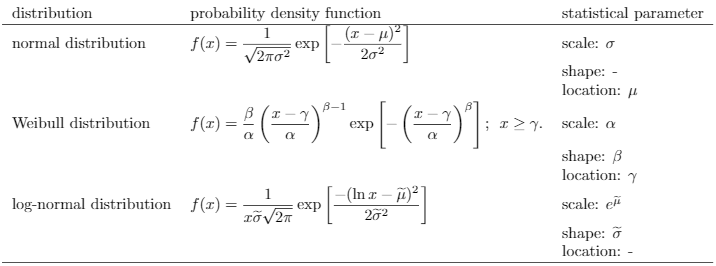
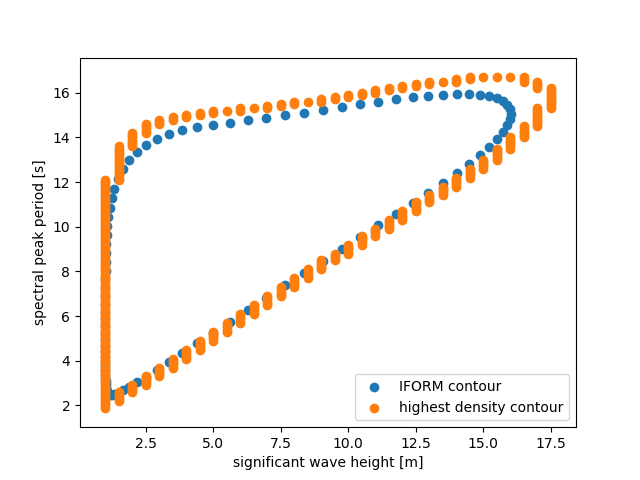

********************************
Calculate environmental contours
********************************
The main use of this package is to create environmental contours. For this purpose one has to define a multivariate distribution, choose one of two calculation methods, and initiate the calculation.

This procedure can be further broken down into 8 steps:

1. Create a first, independent distribution.

2. Create another, (possibly) dependent distribution and define its dependency on the previous distributions.

3. Repeat step 2, until you have created the desired amount of distributions.

4. Bundle the created uni-variate distributions and the defined dependencies in a multivariate distribution.

5. Define the common parameters, return period and environmental state duration for the contour.

6. Choose one of the two calculation options: :class:`HighestDensityContour <viroconcom.contours.HighestDensityContour>` or :class:`~viroconcom.contours.IFormContour`.

7. Define the calculation specific parameters.

8. Initiate the calculation.

These steps are explained in more detail in the following.

The file calculate_contours_similar_to_docs_ contains all the code that we will
show on this page.

.. _calculate_contours_similar_to_docs: https://github.com/virocon-organization/viroconcom/blob/master/examples/calculate_contours_similar_to_docs.py

.. _create-independent-dist:

Create independent distribution
===============================

Distributions are represented by the abstract class :class:`~viroconcom.distributions.Distribution`. This class is further subclassed by the abstract class :class:`~viroconcom.distributions.ParametricDistribution`. Distributions of this kind are described by three parameters: ``shape``, ``loc``, and ``scale``. Though not all distributions need to make use of all three parameters.

Currently there are 3 parametric distribution subclasses one can use to instantiate a distribution:

* :class:`~viroconcom.distributions.WeibullDistribution`
* :class:`~viroconcom.distributions.LognormalDistribution`
* :class:`~viroconcom.distributions.NormalDistribution`

This table shows, which variables of the probability density function are are defined by specifying the scale, shape and location parameters:

   Distributions implemented in viroconcom and their parameters.

.. note::
    There is also :class:`~viroconcom.distributions.KernelDensityDistribution`, which is a non-parametric distribution, that can only be instantiated by :doc:`fitting <fitting>`.

For the parameters there is the abstract class :class:`~viroconcom.params.Param`. As we want to create an independet distribution, we use the subclass :class:`~viroconcom.params.ConstantParam` to define ``shape``, ``loc``, and ``scale``.

Say we want to create a weibull distribution with ``shape=1.5``, ``loc=1``, and ``scale=3``.

We first create the parameters::

    shape = ConstantParam(1.5)
    loc = ConstantParam(1)
    scale = ConstantParam(3)

And then create our weibull distribution::

    dist0 = WeibullDistribution(shape, loc, scale)

We also need to create a dependency tuple for creating a :class:`~viroconcom.distribution.MultivariateDistribution` later on. This is a 3-element tuple with either ``int`` or ``None`` as entries. The first entry corresponds to ``shape``, the second to ``loc`` and the third to ``scale``. For further information see :ref:`create-dependent-dist`. For an independent distribution all entries need to be set to ``None``. ::

    dep0 = (None, None, None)

.. _create-dependent-dist:

Create dependent distribution
==============================

The dependency of a parametric distribution is described by the dependency of its parameters. In :ref:`create-independent-dist` we used :class:`~viroconcom.params.ConstantParam` for the parameters. There is also :class:`~viroconcom.params.FunctionParam`, that is callable which returns a parameter value depending on the value called with.

.. note::
    Actually :class:`~viroconcom.params.ConstantParam` is a callable as well, which returns the same value, indepently of the value called with.

Say we have a random variable (RV) :math:`X` that is described by the distribution created in :ref:`create-independent-dist`. We now want to create a dependent distribution that describes the random variable :math:`Y`, which is dependent on :math:`X`. We can do this by making the parameters of that distribution, dependent on the realizations :math:`x` of RV :math:`X`.

For this we first need to define an order of the distributions, so that we can determine on which distributions another may depend. We define this order, as the order in which the univariate distribution are later on passed to the :class:`~viroconcom.distributions.MultivariateDistribution` constructor. For now we use the order of creation. So the first in :ref:`create-independent-dist` created weibull distribution has the index ``0``. We use this order in the dependency tuples.

As already described in :ref:`create-independent-dist` the 3 entries in the tuple correspond to the ``shape``, ``loc``,  and ``scale`` parameters and the entries are either ``int`` or ``None``. If an entry is ``None``, the corresponding parameter is not dependent. If an entry is an ``int`` the parameter depends on the distribution with that index, in the order defined above.

For example a dependency tuple of :code:`(0, None, 1)` means, that ``shape`` depends on the first distribution, ``loc`` is independent and ``scale`` depends on the second distribution.

We now want to create a dependent lognormal distribution. These distributions are often not described by ``shape``, ``loc``,  and ``scale``, but by the mean ``mu`` and standard deviation ``sigma`` of the corresponding normal distribution and we want ``mu`` and ``sigma`` to depend on the prior created weibull distribution. The ``loc`` parameter is ignored by the :class:`~viroconcom.distribution.LognormalDistribution`.

The conversion is:

.. math::
    shape = sigma

.. math::
    scale = e^{mu}

But the class :class:`~viroconcom.distribution.LognormalDistribution` has also an alternative constructor for this case, which can be used by passing ``mu`` and ``sigma`` as keyword arguments.

The dependency can be described as follows, where :math:`x` is a realization of RV :math:`X`:

.. math::
    sigma(x) = 0.05 + 0.2 * e^{-0.2}

.. math::
    mu(x) = 0.1 + 1.5^{x * 0.2}

First we create the parameters as :class:`~viroconcom.params.FunctionParam`::

    my_sigma = FunctionParam(0.05, 0.2, -0.2, "exp3")
    my_mu = FunctionParam(0.1, 1.5, 0.2, "power3")

Then we create the :class:`~viroconcom.distribution.LognormalDistribution` using the alternative constructor::

    dist1 = LognormalDistribution(sigma=my_sigma, mu=my_mu)

And eventually define the dependency tuple::

    dep1 = (0, None, 0)

Alternativly we could have defined the distribution as follows, using the wrapper argument of the :class:`~viroconcom.params.FunctionParam`::

    shape = FunctionParam(0.05, 0.2, -0.2, "exp3")
    scale = FunctionParam(0.1, 1.5, 0.2, "power3", wrapper=numpy.exp)
    dist1 = LognormalDistribution(shape, None, scale)
    dep1 = (0, None, 0)

.. _bundle-multvar-dist:

Bundle distributions and dependencies in a multivariate distribution
====================================================================

To create a contour one usually needs a multi-dimensional distribution. Such a distribution can be represented by the :class:`~viroconcom.distributions.MultivariateDistribution` class.

To create a :class:`~viroconcom.distributions.MultivariateDistribution` we first have to bundle the distributions and dependencies in lists::

    distributions = [dist0, dist1]
    dependencies = [dep0, dep1]

The :class:`~viroconcom.distributions.MultivariateDistribution` can now simply be created by passing these lists to the constructor::

    mul_dist = MultivariateDistribution(distributions, dependencies)

.. note::

    Alternativly one can create the :class:`~viroconcom.distributions.MultivariateDistribution` iteratively, by first calling the constructor without arguments, and then passing the distributions and dependencies to the ``add_distribution`` method.
    A combination of these two ways is possbible, as well.

Calculating the contour
=======================

One now has to define return period and state-duration and pick one of the two possible ways to calculate a contour.

- :ref:`Inverse first-order reliabilty method (IFORM) <iform>`
- :ref:`Highest density contour method (HDC method) <hdc>`

.. _return-period:

return period
    The time between two environmental states that are not inside the contour, in years.

.. _state_duration:

state duration
    The time between two consecutive states, in hours.

.. _iform:

Inverse first-order reliability method (IFORM)
----------------------------------------------

To create an IFORM-contour one has to specify only the number of points to sample, in addition to return period and state duration.

So with the :ref:`previously created <bundle-multvar-dist>` ``mul_dist`` a contour with a ``return_period`` of ``25`` years , a ``state_duration`` of ``3`` hours and ``n_samples=100`` sampling points can be created like this::

    iform_contour = IFormContour(mul_dist, 25, 3, 100, timeout=None)

.. _hdc:

Highest density contour method (HDC method)
-------------------------------------------

To create a highest density contour one has to specify a grid in variable space in addition to return period and state duration. This is done by passing the grid's ``limits`` and ``deltas`` to the constructor. ``limits`` has to be a list of tuples containing the min and max limits for the variable space, one tuple for each dimension. ``deltas`` specifies the grid cell size. It is either a list of length equal to the number of dimension, containing the step size per dimensions or a scalar. If it is a scalar it is used for all dimensions.

The grid includes the min and max values: ``x = [min, min + delta, ..., max - delta, max]``

To create a highest density contour for the :ref:`previously created <bundle-multvar-dist>` ``mul_dist`` with a ``return_period`` of ``25`` years and a ``state_duration`` of ``3``,  we first define the variable space to be between 0 and 20 and set the step size to 0.5 in the first and 0.1 in the second dimension.::

    limits = [(0, 20), (0, 20)]
    deltas = [0.5, 0.1]

The contour can then be created as follows::

    hdens_contour = HighestDensityContour(mul_dist, 25, 3, limits, deltas, timeout=None)

Plotting the contour
--------------------

To plot the contour one has be access the ``coordinates`` attribute of the contour.

.. Note::

    Be wary that the ``coordinates`` attribute is a list of arrays. With a list of :class:`~numpy.ndarrays` as entries and of length equal to the number of dimensions. Usually the outer list has a length of 1. But if a multimodal distribution was used the HDC may consist of multiple partial contours, each with its own entry in the outer list.

Using e.g. ``matplotlib`` the following code... ::

    import matplotlib.pyplot as plt
    plt.scatter(hdens_contour.coordinates[0][0], hdens_contour.coordinates[0][1],
                label="highest density contour")
    plt.scatter(iform_contour.coordinates[0][0], iform_contour.coordinates[0][1],
                label="IFORM contour")
    plt.xlabel('significant wave height [m]')
    plt.ylabel('spectral peak period [s]')
    plt.legend()
    plt.show()

creates this plot:

    Plot of the calculated example contours.
