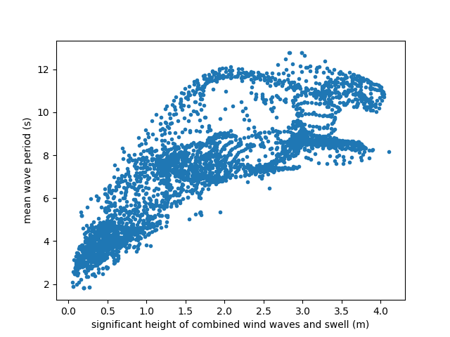

*****************************
Using the integrated Datasets
*****************************
This will show you how you can get data from either NDBC or ECMWF(Era-Interim).

Get data from NDBC server
=========================

To load data from NDBC first thing to do is to choose a buoy and set a variable with the number of it.
Next, set up a start and end date, this has to be in a specific form. Make sure that the buoy has data in the time frame
that is set up, by looking at NDBC`s website (https://www.ndbc.noaa.gov/), otherwise an error will occur.

Once this is done, an instance of :class:`~viroconcom.dataNDBC.NDBC` will be made and passed the buoy number to.
Then the method get_data gets called as following::

    buoy = 41108
    date = "2017-02-11/to/2018-11-27"

    df = NDBC(buoy).get_data(date)

That is basically it. Now, to get a specific variable, simply call in this case::

    df.WVHT
    df.APD

This gives the significant wave height with WVHT and the average wave period with APD.
Have a look in dataNDBC_ file for what variables are available or go on NDBC website.
.. _dataNDBC: https://github.com/adrdrew/viroconcom/blob/master/viroconcom/dataNDBC.py

Plot the data from NDBC
-----------------------
This is straight forward, there are two lists of data.
To plot them each, follow this code::

    # Plot significant wave height.
    sub1 = plt.subplot(2, 2, 1)
    df.WVHT.plot()
    sub1.set_ylabel('Significant wave height (m)', fontsize=14)
    sub1.set_xlabel('Date')

    # Plot average wave period.
    sub2 = plt.subplot(2, 2, 3)
    df.APD.plot()
    sub2.set_ylabel('Average wave period (s)', fontsize=14)
    sub2.set_xlabel('Date')
    plt.show()

And to perform a scatter-plot, follow this code::

    # Scatter-plot of the data.
    sub3 = plt.subplot(2, 2, (2, 4))
    plt.scatter(df.WVHT, df.APD)
    sub3.set_xlabel('Significant wave height (m)', fontsize=14)
    sub3.set_ylabel('Average wave period (s)', fontsize=14)
    sns.despine()
    plt.show()

After plotting, this will show up:

.. figure:: exampleNDBC.png
    :scale: 50 %
    :alt: example data plot

    Plot of the data from NDBC.

The code used: exampleNDBC_
.. _exampleNDBC: https://github.com/adrdrew/viroconcom/blob/master/examples/exampleNDBC.py

Get data from ECMWF server
==========================

Here is a small instruction what to do before using ECMWF:

To pull data from ECMWF (https://www.ecmwf.int/en/forecasts/datasets/reanalysis-datasets/era-interim) you must have
an account on their website, put your key and E-Mail in :class:`~viroconcom.dataECMWF` and although save them as
environment variables on your computer as following::

    export ECMWF_API_URL="https://api.ecmwf.int/v1"
    export ECMWF_API_KEY="key"
    export ECMWF_API_EMAIL="email"

.. note::

    You have to put the key you get from ECMWF in "key" and your E-Mail you used to login in ECMWF as "email".

For further Information visit: https://confluence.ecmwf.int/display/WEBAPI/Access+ECMWF+Public+Datasets
The ecmwf-api-client will be installed with the requirements. Also, it is important to install the
certificate: https://github.com/adrdrew/viroconcom/blob/master/quovadis_rca2g3_der.cer

This is all needed, to run the following:

Setup the :class:`~viroconcom.dataECMWF.ECMWF` by giving it the Argument required::

    # Gets the sample and writes it into a file.
    ecmwf = ECMWF("00:00:00", "0.75/0.75", "75/-20/10/60", "229.140/232.140")
    ecmwf.get_data("2018-09-01/to/2018-09-30")

This writes the asked data of specific area into a file that is saved in ../examples/datasets after running the code.
Now, open the file for reading::

    # Open the file for reading.
    test_nc_file = '../examples/datasets/ecmwf.nc'
    nc = netCDF4.Dataset(test_nc_file, mode='r')

Since this is a complex data structure, dimensions, attributes and variables should be printed, to navigate in
the structure::

    # Print the Dimensions.
    dims = nc.dimensions
    for key in dims:
        print("dimension: ["+key+"] = "+str(len(dims[key])))
    # Print number of global attributes.
    glob_attrs = nc.ncattrs()
    print("Number of global attributes = "+str(len(glob_attrs)))
    # Print global attributes.
    for key in glob_attrs:
        print("Global attribute: ["+key+"]= "+str(getattr(nc, key)))
    # Print number of variables.
    var_s = nc.variables
    print("Number of variables = "+str(len(var_s)))
    # Print which variables are available.
    for var in var_s:
        print("--------Variable "+var+"--------")
        print("Shape = "+str(var_s[var].shape))
        var_dims = var_s[var].dimensions
        for vd in var_dims:
            print("Dimension ["+vd+"]= " + str(len(dims[vd])))

To see what the data is like, it is obvious to print a slice of the data::

    # Now, if you want to print a slice of the data, choose the variable, here we choose 'swh'
    # which means significant height of combined wind waves and swell.

    # First print attributes.
    var = 'swh'
    var_attrs = var_s[var].ncattrs()
    print("Number of attributes = "+str(len(var_attrs)))
    for vat in var_attrs:
        print("Attribute ["+vat+"]= " + str(getattr(var_s[var], vat)))
    # Now print the slice of data.
    data = var_s[var][1:2]
    print(data)

Finally, it is handy to plot the data to see its full range::

    # And plot part of it against 'mwp' data.
    plt.scatter(data[0], var_s['mwp'][1:2][0], marker='.')
    plt.xlabel('significant height of combined wind waves and swell (m)')
    plt.ylabel('mean wave period (s)')
    plt.show()

The plot shows this picture:

    Plot of the data from ECMWF.