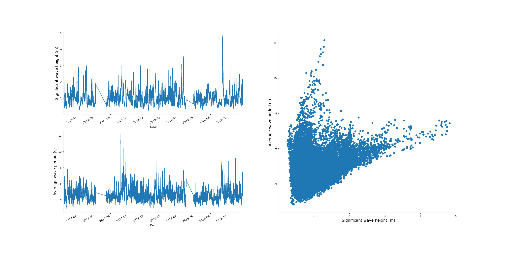

*****************************
Using the integrated Datasets
*****************************
This will show you how you can get data from either NDBC or ECMWF(Era-Interim).

Get data from NDBC server
=========================

To load data from NDBC first thing to do is to choose a buoy and set a variable with the number of it.
Next, set up a start and end date, this has to be in a specific form. Make sure that your buoy has data in the time you
set up, by looking at NDBC`s website (https://www.ndbc.noaa.gov/), otherwise you will get an error.

Once you have done this, you can make an instance of :class:`~viroconcom.dataNDBC.NDBC` and pass your buoy number.
Then call the method get_data as following::

    buoy = 41108
    date = "2017-02-11/to/2018-11-27"

    df = NDBC(buoy).get_data(date)

That is basically it. Now, to get a specific variable, you can look in dataNDBC_ file for what variables
.. _dataNDBC: https://github.com/adrdrew/viroconcom/blob/master/viroconcom/dataNDBC.py
are available or go on NDBC website, simply call in this case::

    df.WVHT
    df.APD

This will give you the significant wave height with WVHT and the average wave period with APD.

Plot the data from NDBC
-----------------------
This is straight forward, you got two lists of data.
To plot them each, follow this code::

    # Plot significant wave height.
    sub1 = plt.subplot(2, 2, 1)
    df.WVHT.plot()
    sub1.set_ylabel('Significant wave height (m)', fontsize=14)
    sub1.set_xlabel('Date')

    # Plot average wave period.
    sub2 = plt.subplot(2, 2, 3)
    df.APD.plot()
    sub2.set_ylabel('Average wave period (s)', fontsize=14)
    sub2.set_xlabel('Date')
    plt.show()

And to perform a scatter-plot, follow this code::

    # Scatter-plot of the data.
    sub3 = plt.subplot(2, 2, (2, 4))
    plt.scatter(df.WVHT, df.APD)
    sub3.set_xlabel('Significant wave height (m)', fontsize=14)
    sub3.set_ylabel('Average wave period (s)', fontsize=14)
    sns.despine()
    plt.show()

If you do all the plotting you will get:

    Plot of the data from NDBC.

You can find the used code in exampleNDBC_
.. _exampleNDBC: https://github.com/adrdrew/viroconcom/blob/master/examples/exampleNDBC.py
