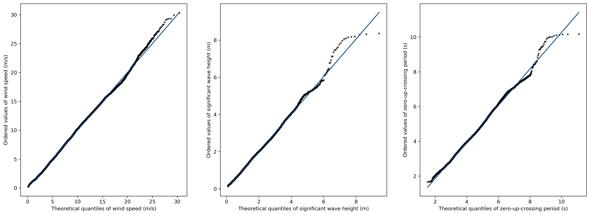
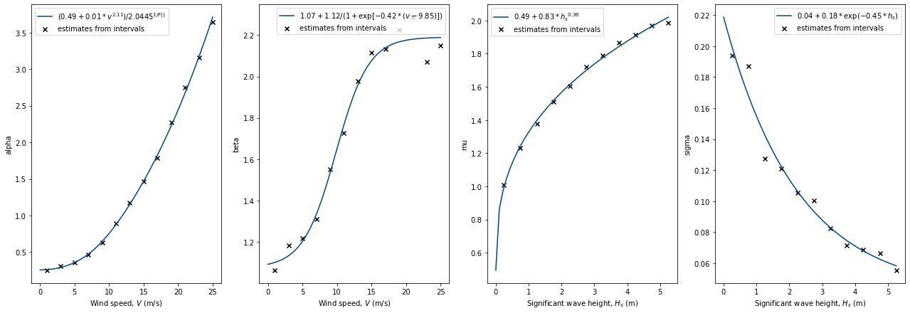
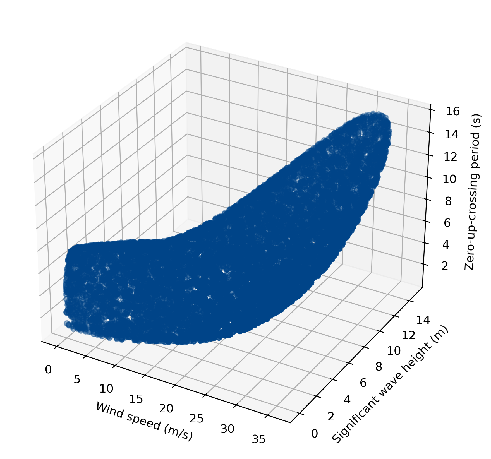

*****************
Detailed examples
*****************

This chapter will explain how the structure of the joint distribution model is created in virocon. The process of
estimating the parameter values of a joint distribution, the “fitting” is explained in more detail by means of two
examples. To create an environmental contour, first, we need to define a joint distribution. Then, we can choose a
specific contour method and initiate the calculation. virocon uses so-called global hierarchical models to define the
joint distribution and offers common methods how an environmental contour can be defined based on a given joint
distribution. Generally, virocon provides two ways of creating a joint model and calculating a contour. The first option
is using an already predefined model, which was explained before in the quick start section (see :ref:`quick-start-guide`).
The second option is defining a custom statistical model, which is described in the following.

If the joint distribution is known, the procedure of calculating an environmental contour with virocon can be summarized as:

1.	Load the environmental data that should be described by the joint model.
2.	Define the structure of the joint model that we will use to describe the environmental data. To define a joint model, we define the univariate parametric distributions and the dependence structure. The dependence structure is defined using parametric dependence functions.
3.	Estimate the parameter values of the joint model (fitting).
4.	Define the contour’s return period and environmental state duration (for more detailed explanation see :ref:`definitions`).
5.	Choose a type of contour: IFormContour, ISormContour, DirectSamplingContour or HighestDensityContour (for more detailed explanation see :ref:`definitions`).

50 year environmental contour: Hs-Tz DNVGL model
~~~~~~~~~~~~~~~~~~~~~~~~~~~~~~~~~~~~~~~~~~~~~~~~

Here, we use a sea state dataset with the variables Hs (significant wave height) and Tz (zero-up-crossing period), fit
the joint distribution recommended in DNVGL-RP-C203 [1]_ to it and compute an IFORM contour. This example reproduces the
results published in Haselsteiner et al. (2019) [2]_. Such a work flow is for example typical in ship design. The
presented example can be downloaded from the examples_ section of the repository.

**Imports**

.. code-block:: python

    import numpy as np
    import matplotlib.pyplot as plt

    from virocon import (
    read_ec_benchmark_dataset,
    GlobalHierarchicalModel,
    WeibullDistribution,
    LogNormalDistribution,
    DependenceFunction,
    WidthOfIntervalSlicer,
    IFORMContour,
    plot_marginal_quantiles,
    plot_dependence_functions,
    plot_2D_contour,
    )

**Environmental data**

This dataset has been used in a benchmarking exercise, see https://github.com/ec-benchmark-organizers/ec-benchmark .
The dataset was derived from NDBC buoy 44007, see https://www.ndbc.noaa.gov/station_page.php?station=44007 .
The datasets are available here: data_.

.. code-block:: python

    data = read_ec_benchmark_dataset("datasets/ec-benchmark_dataset_A.txt")

**Dependence structure**

Define the structure of the joint model that we will use to describe the environmental data. To define a joint model, we
define the univariate parametric distributions and the dependence structure. The dependence structure is defined using
parametric functions. In this case, we used a 3-parameter power function and a 3-parameter exponential function as
dependence functions. A dependence function must always contain a simple python function. Additionally we can constrain
the functions parameters by supplying boundaries.

.. code-block:: python

    def _power3(x, a, b, c):
        return a + b * x ** c

    def _exp3(x, a, b, c):
        return a + b * np.exp(c * x)

**Parametric distributions**

First, lower and upper interval boundaries for the three parameter values needs to be set. The dist_descriptions are
dictionaries that include the description of the distributions. The dictionary has the following keys depending on
whether the distribution is conditional or not: "distribution", "intervals", "conditional_on", "parameters". The key
"intervals" is only used when describing unconditional distributions while the keys "conditional_on" and "parameters"
are only used when describing conditional variables. The key "distributions" needs to be specified in both cases.
With "distribution" an object of :class:`~virocon.distributions` is committed. Here, we indicate the statistical
distribution which describes the environmental variable best. In "intervals" we indicate, which method should be used to
split the range of values of the first environmental variable into intervals. The conditional variable is then dependent
on intervals of the first environmental variable. The key "conditional_on" indicates the dependencies between the
variables of the model. Only one entry per distribution/dimension is possible. It contains either None or int. If the
first entry is None, the first distribution is unconditional. If the following entry is an int, the following
distribution depends on the first dimension as already described above. In "parameters" we indicate the dependency
functions that describe the dependency of the statistical parameters on the independent environmental variable.

Here, dist_description_0 is the independent variable which is described by a Weibull distribution and split in equally
sized intervals of width 0.5. dist_description_1 is described by a Lognormal distribution and is conditional on the
first distribution (indicated by "conditional_on": 0). The dependency of the individual parameters, mu and sigma of the
Lognormal distribution are described by a power function and an exponential function.

.. code-block:: python

    bounds = [(0, None), (0, None), (None, None)]

    power3 = DependenceFunction(_power3, bounds)
    exp3 = DependenceFunction(_exp3, bounds)

    dist_description_0 = {
        "distribution": WeibullDistribution(),
        "intervals": WidthOfIntervalSlicer(width=0.5),
    }
    dist_description_1 = {
        "distribution": LogNormalDistribution(),
        "conditional_on": 0,
        "parameters": {"mu": power3, "sigma": exp3}
    }

**Joint distribution model**

In the following, the joint model is created from the dist description described above. Here, we are using global
hierarchical models which are probabilistic models that covers the complete range of an environmental variable
("global"), following a particular hierarchical dependence structure. The factorization describes a hierarchy where a
random variable with index i can only depend upon random variables with indices less than i [3]_ .

.. code-block:: python

    model = GlobalHierarchicalModel([dist_description_0, dist_description_1])

We define a semantics dictionary, that describes the model. This description can be used while plotting the contour.

.. code-block:: python

    semantics = {
    "names": ["Significant wave height", "Zero-crossing period"],
    "symbols": ["H_s", "T_z"],
    "units": ["m", "s"],
    }

Fit the model to the data (estimate the model's parameter values) and print the estimated parameter values. Afterwards,
we create plots to inspect the model's goodness-of-fit.

.. code-block:: python

    model.fit(data)
    print(model)

    fig1, axs = plt.subplots(1, 2, figsize=[10, 4.8])
    plot_marginal_quantiles(model, data, semantics, axes=axs)
    fig2, axs = plt.subplots(1, 2, figsize=[10, 4.8])
    plot_dependence_functions(model, semantics, axes=axs)

The following plots are created:

.. figure:: Q-Q_Plot_Hs_Tz.png
    :scale: 100 %
    :alt: Q-Q plot of significant wave height and zero-crossing period.

.. figure:: Dependency_fitting_HsTz.png
    :scale: 100 %
    :alt: Dependency functions of significant wave height and zero-crossing period.

**Environmental contour**

Compute an IFORM contour with a return period of 20 years and plot the contour on top of a scatter diagram of the
metocean data.

.. code-block:: python

    state_duration = 1  # hours
    return_period = 20  # years
    alpha = state_duration / (return_period * 365.25 * 24)
    contour = IFORMContour(model, alpha)

    ax = plot_2D_contour(contour, sample=data, semantics=semantics, swap_axis=True)
    plt.show()

.. figure:: Environmental_Contour_HsTz.png
    :scale: 100 %
    :alt: Sea state contour.

.. _examples: https://github.com/virocon-organization/virocon/tree/master/examples
.. _data: https://github.com/virocon-organization/virocon/tree/master/datasets
.. _datasets: https://www.ndbc.noaa.gov/station_page.php?station=44007

.. [1] DNV GL (2017). Recommended practice DNVGL-RP-C205: Environmental conditions and environmental loads.
.. [2] Haselsteiner, A.F.; Coe, R.; Manuel, L.; Nguyen, P.T.T.; Martin, N.; Eckert-Gallup A. (2019): A benchmarking exercise on estimating extreme environmental conditions: methodology and baseline results. Proceedings of the 38th International Conference on Ocean, Offshore and Arctic Engineering OMAE2019, June 09-14, 2019, Glasgow, Scotland.
.. [3] Haselsteiner, A.F.; Sander, A.; Ohlendorf, J.H.; Thoben, K.D. (2020): Global hierarchical models for wind and wave contours: physical interpretations of the dependence functions. OMAE 2020, Fort Lauderdale, USA. Proceedings of the 39th International Conference on Ocean, Offshore and Arctic Engineering.

50 year environmental contour: V-Hs-Tz
~~~~~~~~~~~~~~~~~~~~~~~~~~~~~~~~~~~~~~
Here, we use an environmental dataset with the variables V (wind speed) Hs (significant wave height) and Tz
(zero-up-crossing period), fit a joint distribution to it and compute a 3D HDC contour. The presented example can be
downloaded from the examples_ section of the repository. The dataset is available here: data_. Since the basic
principles of calculating an environmental contour are described above for the 2-dimensional case, some explanations are
shorter.

**Imports**

.. code-block:: python

    import numpy as np
    import matplotlib.pyplot as plt
    from skimage.measure import marching_cubes
    import pandas as pd

    from virocon import (
    read_ec_benchmark_dataset,
    GlobalHierarchicalModel,
    LogNormalDistribution,
    ExponentiatedWeibullDistribution,
    DependenceFunction,
    WidthOfIntervalSlicer,
    HighestDensityContour,
    plot_marginal_quantiles,
    plot_dependence_functions,
    )

**Environmental data**

To compute the 3D HDC contour, we use a dataset from coastDat2 [4]_ . The original dataset is shortened to one year to
reduce computational costs.

.. code-block:: python

    data = pd.read_csv("datasets/NREL_data_oneyear.csv", sep=";", skipinitialspace=True)
    data.index = pd.to_datetime(data.pop(data.columns[0]), format="%Y-%m-%d-%H")

**Dependence structure**

Here, we define the structure of the joint model that will be used to describe the environmental data. To describe such
a model, we again define the univariate parametric distributions and the dependence structure. As mentioned above, the
dependence structure is defined using parametric functions. In this case, we use 4 different dependence functions.

.. code-block:: python

    def _power3(x, a, b, c):
        return a + b * x ** c

    def _exp3(x, a, b, c):
        return a + b * np.exp(c * x)

    def _alpha3(x, a, b, c, d_of_x):
        return (a + b * x ** c) / 2.0445 ** (1 / d_of_x(x))

    def _logistics4(x, a=1, b=1, c=-1, d=1):
        return a + b / (1 + np.exp(c * (x - d)))

**Parametric distributions**

As in the 2-dimensional case, lower and upper interval boundaries for the three parameter values needs to be set. Here,
dist_description_0 is the independent variable (wind speed) which is described by an exponentiated Weibull distribution
and split in equally sized intervals of width 2 m/s^2 . dist_description_1 (significant wave height) is also described
by an exponentiated Weibull distribution and is conditional on the wind speed (indicated by "conditional_on": 0). The
significant wave height is split in equally sized intervals of width 0.5 m. dist_description_2 (zero-up-crossing period)
is described by a Lognormal distribution and is conditional on the significant wave height
(indicated by "conditional_on": 1).

.. code-block:: python

    bounds = [(0, None), (0, None), (None, None)]
    logistics_bounds = [(0, None), (0, None), (None, 0), (0, None)]

    power3 = DependenceFunction(_power3, bounds, latex="$a + b * x^c$")
    exp3 = DependenceFunction(_exp3, bounds, latex="$a + b * \exp(c * x)$")
    logistics4 = DependenceFunction(_logistics4, logistics_bounds,
                                    weights=lambda x, y: y,
                                    latex="$a + b / (1 + \exp[c * (x -d)])$")
    alpha3 = DependenceFunction(_alpha3, bounds, d_of_x=logistics4,
                                   weights=lambda x, y: y,
                                   latex="$(a + b * x^c) / 2.0445^{1 / F()}$")

    dist_description_0 = {
        "distribution": ExponentiatedWeibullDistribution(),
        "intervals": WidthOfIntervalSlicer(2, min_n_points=50),
    }

    dist_description_1 = {
        "distribution": ExponentiatedWeibullDistribution(f_delta=5),
        "intervals": WidthOfIntervalSlicer(0.5),
        "conditional_on": 0,
        "parameters": {"alpha": alpha3, "beta": logistics4,},
    }

    dist_description_2 = {
        "distribution": LogNormalDistribution(),
        "conditional_on": 1,
        "parameters": {"mu": power3, "sigma": exp3},
    }

**Joint distribution model**

Again, a global hierarchical model is created from the dist description described above. Afterwards, we create plots to
inspect the model's goodness-of-fit.

.. code-block:: python

    model = GlobalHierarchicalModel([dist_description_0, dist_description_1, dist_description_2])

    semantics = {
        "names": ["Wind speed", "Significant wave height", "Zero-up-crossing period"],
        "symbols": ["V", "H_s", "T_z"],
        "units": ["m/s", "m", "s"],
    }

    model.fit(data)
    print(model)

    fig1, axs = plt.subplots(1, 3, figsize=[18, 7.2])
    plot_marginal_quantiles(model, data, semantics, axes=axs)
    fig2, axs = plt.subplots(1, 4, figsize=[22, 7.2])
    plot_dependence_functions(model, semantics, axes=axs)

The following plots are created:

**3D Contour**

Note, that virocon does not provide own methods to plot 3D environmental contours. Therefore we linked relevant
documentation for additional information. First, we need to set up a multi-dimensional mesh-grid for the 3D surface. For
more detailed explanation on how to use meshgrids, see meshgrid_.

.. code-block:: python

    v_step = 2.0
    h_step = 0.4
    t_step = 0.4
    v1d = np.arange(0, 50, v_step)
    vgrid, h, t = np.mgrid[0:50:v_step, 0:22:h_step, 0:22:t_step]
    f = np.empty_like(vgrid)

    for i in range(vgrid.shape[0]):
        for j in range(vgrid.shape[1]):
            for k in range(vgrid.shape[2]):
                f[i,j,k] = model.pdf([vgrid[i,j,k], h[i,j,k], t[i,j,k]])
    print('Done with calculating f')

Second, we compute a HDC contour with a return period of 20 years and plot the contour as a 3D surface. For additional
information on how to create a 3-dimensional surface, see marchingcubes_

 .. code-block:: python

    state_duration = 1  # hours
    return_period = 20  # years
    alpha = state_duration / (return_period * 365.25 * 24)
    HDC = HighestDensityContour(model, alpha, limits=[(0, 50), (0, 25), (0, 25)])
    print('20-yr HDC has a density value of ' + str(HDC.fm))
    iso_val = HDC.fm
    verts, faces, _, _ = marching_cubes(f, iso_val,
    spacing=(v_step, h_step, t_step))

Finally, we can plot the 3D environmental contour:

.. code-block:: python

    fig = plt.figure()
    ax = fig.add_subplot(111, projection='3d')
    ax.plot_trisurf(verts[:, 0], verts[:,1], faces, verts[:, 2], lw=1)
    ax.set_xlabel('Wind speed (m/s)')
    ax.set_ylabel('Significant wave height (m)')
    ax.set_zlabel('Zero-up-crossing period (s)')

The following plots are created:

.. _meshgrid: https://numpy.org/doc/stable/reference/generated/numpy.mgrid.html
.. _marchingcubes: https://scikit-image.org/docs/dev/auto_examples/edges/plot_marching_cubes.html

.. [4] Groll, N. and Weisse, R.: A multi-decadal wind-wave hindcast for the North Sea 1949–2014: coastDat2, Earth Syst. Sci. Data, 9, 955–968, https://doi.org/10.5194/essd-9-955-2017, 2017.