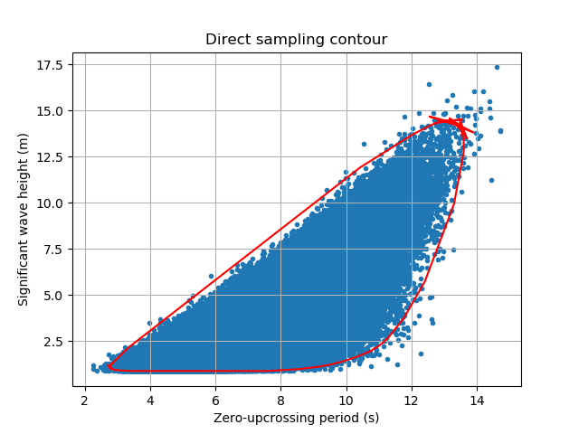

*******************************************************************
Calculate direct sampling contour on a Monte Carlo simulated sample
*******************************************************************
This shows how to create your own Direct Sampling Contour on a two dimensional distribution. The sample will be Monte Carlo simulated from a defined distribution.

The major steps to go through this process are:

1. Create your first independent distribution.

2. Create a second distribution, that should be dependent on the first one, but does not has to be.

3. Take this two distributions an put them in a multivariant distribution.

4. Define the common paramters, return period and state duration for the contour.

5. Define the parameter step in degrees.

6. Initiate the calculation.

7. Plot the contour and sample.

Following these steps are explained in detail.

The code we will need here is in the file draw_sample_calculate_contour_

.. _draw_sample_calculate_contour: https://github.com/adrdrew/viroconcom/blob/master/examples/draw_sample_calculate_contour.py

.. _create-independent-dist:

Create independent distribution
===============================

Distributions are represented by the abstract class :class:`~viroconcom.distributions.Distribution`. This class is further subclassed by the abstract class :class:`~viroconcom.distributions.ParametricDistribution`. Distributions of this kind are described by three parameters: ``shape``, ``loc``, and ``scale``. Though not all distributions need to make use of all three parameters.

Currently there are 4 parametric distribution subclasses one can use to instantiate a distribution:

* :class:`~viroconcom.distributions.WeibullDistribution`
* :class:`~viroconcom.distributions.ExponentiatedWeibullDistribution`
* :class:`~viroconcom.distributions.LognormalDistribution`
* :class:`~viroconcom.distributions.NormalDistribution`

This table shows, which variables of the probability density function are defined by specifying the scale, shape and location parameters:

.. figure:: distributions_with_parameters.png
   :alt: Distributions implemented in viroconcom and their parameters.
   :align: center

   Distributions implemented in viroconcom and their parameters.

For the parameters there is the abstract class :class:`~viroconcom.params.Param`. As we want to create an independet distribution, we use the subclass :class:`~viroconcom.params.ConstantParam` to define ``shape``, ``loc``, and ``scale``.

Say we want to create a weibull distribution with ``shape=1.471``, ``loc=0.8888``, and ``scale=2.776``.

We first create the parameters::

    shape = ConstantParam(1.471)
    loc = ConstantParam(0.8888)
    scale = ConstantParam(2.776)

And then create our weibull distribution::

    dist0 = WeibullDistribution(shape, loc, scale)

We also need to create a dependency tuple for creating a :class:`~viroconcom.distribution.MultivariateDistribution` later on. This is a 3-element tuple with either ``int`` or ``None`` as entries. The first entry corresponds to ``shape``, the second to ``loc`` and the third to ``scale``. For further information see :ref:`create-dependent-dist`. For an independent distribution all entries need to be set to ``None``. ::

    dep0 = (None, None, None)

.. _create-dependent-dist:

Create dependent distribution
=============================

The dependency of a parametric distribution is described by the dependency of its parameters. In :ref:`create-independent-dist` we used :class:`~viroconcom.params.ConstantParam` for the parameters. There is also :class:`~viroconcom.params.FunctionParam`, that is callable which returns a parameter value depending on the value called with.

.. note::
    Actually :class:`~viroconcom.params.ConstantParam` is a callable as well, which returns the same value, indepently of the value called with.

Say we have a random variable (RV) :math:`X` that is described by the distribution created in :ref:`create-independent-dist`. We now want to create a dependent distribution that describes the random variable :math:`Y`, which is dependent on :math:`X`. We can do this by making the parameters of that distribution, dependent on the realizations :math:`x` of RV :math:`X`.

For this we first need to define an order of the distributions, so that we can determine on which distributions another may depend. We define this order, as the order in which the univariate distribution are later on passed to the :class:`~viroconcom.distributions.MultivariateDistribution` constructor. For now we use the order of creation. So the first in :ref:`create-independent-dist` created weibull distribution has the index ``0``. We use this order in the dependency tuples.

As already described in :ref:`create-independent-dist` the 3 entries in the tuple correspond to the ``shape``, ``loc``,  and ``scale`` parameters and the entries are either ``int`` or ``None``. If an entry is ``None``, the corresponding parameter is not dependent. If an entry is an ``int`` the parameter depends on the distribution with that index, in the order defined above.

For example a dependency tuple of :code:`(0, None, 1)` means, that ``shape`` depends on the first distribution, ``loc`` is independent and ``scale`` depends on the second distribution.

We now want to create a dependent lognormal distribution. These distributions are often not described by ``shape``, ``loc``,  and ``scale``, but by the mean ``mu`` and standard deviation ``sigma`` of the corresponding normal distribution and we want ``mu`` and ``sigma`` to depend on the prior created weibull distribution. The ``loc`` parameter is ignored by the :class:`~viroconcom.distribution.LognormalDistribution`.

The conversion is:

.. math::
    shape = sigma

.. math::
    scale = e^{mu}

But the class :class:`~viroconcom.distribution.LognormalDistribution` has also an alternative constructor for this case, which can be used by passing ``mu`` and ``sigma`` as keyword arguments.

The dependency can be described as follows, where :math:`x` is a realization of RV :math:`X`:

.. math::
    sigma(x) = 0.0400 + 0.1748 * e^{-0.2243}

.. math::
    mu(x) = 0.1 + 1.489^{x * 0.1901}

First we create the parameters as :class:`~viroconcom.params.FunctionParam`::

    my_sigma = FunctionParam("exp3", 0.0400, 0.1748, -0.2243)
    my_mu = FunctionParam("power3", 0.1, 1.489, 0.1901)

Then we create the :class:`~viroconcom.distribution.LognormalDistribution` using the alternative constructor::

    dist1 = LognormalDistribution(sigma=my_sigma, mu=my_mu)

And eventually define the dependency tuple::

    dep1 = (0, None, 0)

.. _bundle-multvar-dist:

Bundle distributions and dependencies in a multivariate distribution
====================================================================

To create a contour one usually needs a multi-dimensional distribution. Such a distribution can be represented by the :class:`~viroconcom.distributions.MultivariateDistribution` class.

To create a :class:`~viroconcom.distributions.MultivariateDistribution` we first have to bundle the distributions and dependencies in lists::

    distributions = [dist0, dist1]
    dependencies = [dep0, dep1]

The :class:`~viroconcom.distributions.MultivariateDistribution` can now simply be created by passing these lists to the constructor::

    mul_dist = MultivariateDistribution(distributions, dependencies)

.. note::

    Alternativly one can create the :class:`~viroconcom.distributions.MultivariateDistribution` iteratively, by first calling the constructor without arguments, and then passing the distributions and dependencies to the ``add_distribution`` method.
    A combination of these two ways is possbible, as well.

Monte Carlo simulate the sample
===============================

Now, you can get a sample. You have to define how many datapoints it should contain.::

    n = 1000000
    sample = mul_dist.draw_sample(n)

Calculating the contour
=======================

Direct sampling contour
-----------------------

Last step is to Calculate the contour. For this you need to create an instans of :class:`~viroconcom.contours.DirectSamplingContour` and then define the return period, state duration and step in degrees::

    dsc = DirectSamplingContour
    direct_sampling_contour = dsc.direct_sampling_contour(dsc, sample[0], sample[1], 25, 6, 6)

Plotting the contour
--------------------

Using e.g. ``matplotlib`` the following code... ::

    import matplotlib.pyplot as plt
    plt.scatter(sample[1], sample[0], marker='.')
    plt.plot(direct_sampling_contour[1], direct_sampling_contour[0], color='red')
    plt.title('Direct sampling contour')
    plt.ylabel('Significant wave height (m)')
    plt.xlabel('Zero-upcrossing period (s)')
    plt.grid(True)
    plt.show()

creates this plot:

    Plot of the calculated example contour and sample.