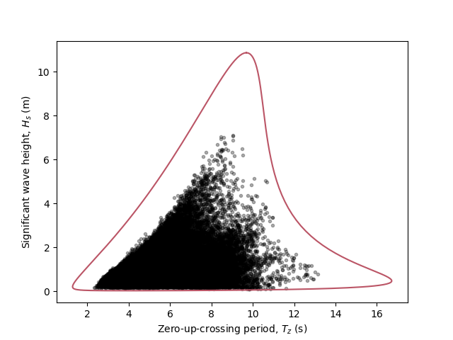

.. _quick-start-guide:

**************************************
Quick start example: Sea state contour
**************************************

Let’s start this user guide with a simple example, which can be copied easily line by line or downloaded from the
examples_ section of the repository. Based on a dataset, the long-term joint distribution of sea states is estimated,
and this distribution will be used to construct an environmental contour with a return period of 50 years. This example
follows the OMAE2020 model by Haselsteiner et al. (2020) [1]_. The following steps are carried out in the quick start
example:

1.	Load the environmental data that should be described by the joint model.
2.	Use a predefined model to describe the dependence structure and define the parametric distributions.
3.	Estimate the parameter values of the MultivariateModel (fitting).
4.	Define the contour’s return period and environmental state duration.
5.	Choose a type of contour: IFormContour, ISormContour, DirectSamplingContour or HighestDensityContour.

Import the required virocon packages and packages that are needed additionally.

.. code-block:: python

    from virocon import (GlobalHierarchicalModel, get_OMAE2020_Hs_Tz, calculate_alpha,
                         IFORMContour, plot_2D_contour, read_ec_benchmark_dataset)
    from matplotlib import pyplot as plt

Load the sea state data set. Here, we use a dataset used in a benchmark study which was published at the OMAE 2019
conference by Haselsteiner et al. (2019) [2]_. The datasets are available here: data_.

.. code-block:: python

    data = read_ec_benchmark_dataset("datasets/ec-benchmark_dataset_A.txt")

We use a predefined model to describe the dependence structure and define the structure of the joint distribution model.
virocon provides simple predefined models, which can be directly executed. Here, we use the Hs-Tz joint distribution
OMAE2020 model by Haselsteiner et al. (2020) [1]_.

.. code-block:: python

    dist_descriptions, fit_descriptions, semantics = get_OMAE2020_Hs_Tz()

Estimate the values of the model’s parameter. This step is also well known as “fitting”.

.. code-block:: python

    model = GlobalHierarchicalModel(dist_descriptions)
    model.fit(data)

Compute the contour: Define the contour’s return period and environmental state duration. Choose a type of contour:
IFormContour, ISormContour, DirectSamplingContour or HighestDensityContour. Plot the contour.

.. code-block:: python

    tr = 50 # Return period in years.
    ts = 1 # Sea state duration in hours.
    alpha = 1 / (tr * 365.25 * 24 / ts)
    contour = IFORMContour(model, alpha)

    plot_2D_contour(contour, data, semantics=semantics, swap_axis=True)
    plt.show()

The code, which is available as a Python file here_, will create this plot
(environmental contour with a return period of 50 years):

.. _examples: https://github.com/virocon-organization/virocon/tree/main/examples
.. _here: https://github.com/virocon-organization/virocon/blob/main/examples/hstz_contour_simple.py
.. _data: https://github.com/virocon-organization/virocon/tree/main/datasets
.. [1] Haselsteiner, A.F.; Sander, A.; Ohlendorf, J.H.; Thoben, K.D. (2020): Global hierarchical models for wind and wave contours: physical interpretations of the dependence functions. OMAE 2020, Fort Lauderdale, USA. Proceedings of the 39th International Conference on Ocean, Offshore and Arctic Engineering.
.. [2] Haselsteiner, A.F.; Coe, R.; Manuel, L.; Nguyen, P.T.T.; Martin, N.; Eckert-Gallup, A. (2019): A benchmarking exercise on estimating extreme environmental conditions: methodology and baseline results. Proceedings of the 38th International Conference on Ocean, Offshore and Arctic Engineering OMAE2019, June 09-14, 2019, Glasgow, Scotland.