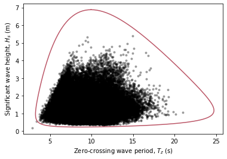

**************************
Example: Sea state contour
**************************

Let's start this user guide with a simple example.

Based on a dataset, the long-term joint distribution of sea states is estimated
and this distribution will be used to construct an environmental contour with a
return period of 50 years. ::

    import matplotlib.pyplot as plt

    from viroconcom.fitting import Fit
    from viroconcom.contours import IFormContour
    from viroconcom.read_write import read_ecbenchmark_dataset
    from viroconcom.plot import plot_contour

    # Load sea state measurements from the NDBC buoy 44007.
    sample_hs, sample_tz, label_hs, label_tz = \
        read_ecbenchmark_dataset('datasets/1year_dataset_A.txt')

    # Define the structure of the probabilistic model that will be fitted to the
    # dataset. This model structure has been proposed in the paper "Global
    # hierarchical models for wind and wave contours: Physical interpretations
    # of the dependence functions" by Haselsteiner et al. (2020).
    dist_description_hs = {'name': 'Weibull_Exp'}
    dist_description_tz = {'name': 'Lognormal_SigmaMu',
                          'dependency': (0,  None, 0),
                          'functions': ('asymdecrease3', None, 'lnsquare2')}
    model_structure = (dist_description_hs, dist_description_tz)

    # Fit the model to the data.
    fit = Fit((sample_hs, sample_tz), model_structure)
    fitted_distribution = fit.mul_var_dist

    # Compute an IFORM contour with a return period of 50 years.
    tr = 50 # Return period in years.
    ts = 1 # Sea state duration in hours.
    contour = IFormContour(fitted_distribution, tr, ts)

    # Plot the data and the contour.
    fig, ax = plt.subplots(1, 1)
    plt.scatter(sample_tz, sample_hs, c='black', alpha=0.5)
    plot_contour(contour.coordinates[1], contour.coordinates[0],
                 ax=ax, x_label=label_tz, y_label=label_hs)
    plt.show()

The code, which is available as a Python file here_, will create this plot:

    Environmental contour with a return period of 50 years.

.. _here: https://github.com/virocon-organization/viroconcom/blob/master/examples/sea_state_iform_contour.py
