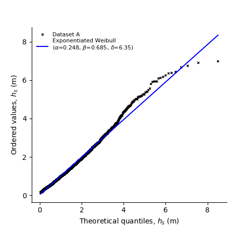

*********************************
Fit your own data with fitting.py
*********************************

This module implements the possibility to fit a probabilistc model to your own data.

If you want to fit multivariate distribution to your data set you have to build an object of the class ``Fit`` in this module.
The necessary parameters for building objects of ``Fit`` are also listed in the documentation of this class.
Exemplary call::

    example_fit = Fit((data_1, data_2), (dist_description_0, dist_description_1), timeout=None)

It is important that the parameter ``samples`` is in the form (sample_0, sample_1, ...).
Each sample is a collection of data from type *list* and also all samples have the same length. The parameter ``dist_descriptions``
describes the structure of the probabilistic model that should be fitted to the sample. It should be from type *list* and should
contain a dictionary for each dimension in the same sequence of the samples. It should accordingly have the same length as ``samples``.

Each ``dist_description`` describes one dimension of the probabilistic model structure. It contains the name of the current distribution (i.e. ``"Weibull"``).
Then it contains the dependency for this dimension from type *list*. In the sequence of ``shape, loc, scale`` it contains integers for the dependency
of the current parameter or *None* if it has no dependency. It is important that the dependency is less than the index of the current dimension.
The list for the parameter ``functions`` also has length of three and contains information about the used functions for fitting.

The following distributions are available (keyword and meaning):

- **Weibull_2p** :  2-parameter Weibull distribution
- **Weibull_3p** :  3-parameter Weibull distribution
- **Lognormal** :  lognormal distribution parametrized with exp(mu) and sigma
- **Lognormal_SigmaMu** :  lognormal distribution parametrized with mu and sigma
- **Normal** :  normal distribution

The following dependence functions are available (keyword and meaning):

- **power3** :  :math:`a + b * x^c`
- **exp3** : :math:`a + b * e^{x * c}`
- **None** : no dependency

Example for ``dist_description``::

	example_dist_description = {'name': 'Lognormal', 'dependency': (0, None, 1),
				                'functions': ('power3', None, 'exp3')}

If the fit is finished it has the attribute ``mul_var_dist`` that is an object of ``MultivariateDistribution`` that contains all distributions you
can use to build a contour for your data. Also it has the attribute ``multiple_fit_inspection_data``, which can be used to visualize
your fit.

Comprehensive example
---------------------

The following example can is based on the file fit_distribution_similar_to_docs_ .

.. _fit_distribution_similar_to_docs: https://github.com/virocon-organization/viroconcom/blob/master/examples/fit_distribution_similar_to_docs.py

First, let us create a data set, which represents sea states. The first variable
is significant wave height, Hs, and the second variable spectral peak period,
Tp ::

    import matplotlib.pyplot as plt
    import numpy as np
    import scipy.stats as sts

    from viroconcom.fitting import Fit
    from viroconcom.contours import IFormContour

    prng = np.random.RandomState(42)

    # Draw 1000 samples from a Weibull distribution with shape=1.5 and scale=3,
    # which represents significant wave height.
    sample_0 = prng.weibull(1.5, 1000)*3

    # Let the second sample, which represents spectral peak period increase
    # with significant wave height and follow a Lognormal distribution with
    # mean=2 and sigma=0.2
    sample_1 = [0.1 + 1.5 * np.exp(0.2 * point) +
                prng.lognormal(2, 0.2) for point in sample_0]

    plt.scatter(sample_0, sample_1)
    plt.xlabel('significant wave height [m]')
    plt.ylabel('spectral peak period [s]')
    plt.show()

The code snipped will create this plot:

.. figure:: fitting_fig1.png
    :scale: 100 %
    :alt: example contours plot

    Plot of a randomly drawn sample.

Now we describe the type of multivariate distribution that we want to fit to this data ::

    dist_description_0 = {'name': 'Weibull_3p', 'dependency': (None, None, None), 'width_of_intervals': 2}
    dist_description_1 = {'name': 'Lognormal', 'dependency': (None, None, 0), 'functions': (None, None, 'exp3')}

Based on this description, we can compute the fit ::

    my_fit = Fit((sample_0, sample_1), (dist_description_0, dist_description_1))

Now, let us plot the fit for the first variable ::

    # For panel A: use a histogram.
    fig = plt.figure(figsize=(9, 4.5))
    ax_1 = fig.add_subplot(121)
    param_grid = my_fit.multiple_fit_inspection_data[0].scale_at
    plt.hist(my_fit.multiple_fit_inspection_data[0].scale_samples[0], density=1,
             label='sample')
    shape = my_fit.mul_var_dist.distributions[0].shape(0)
    scale = my_fit.mul_var_dist.distributions[0].scale(0)
    plt.plot(np.linspace(0, 20, 100),
             sts.weibull_min.pdf(np.linspace(0, 20, 100), c=shape, loc=0,
                                 scale=scale),
             label='fitted Weibull distribution')
    plt.xlabel('significant wave height [m]')
    plt.ylabel('probability density [-]')
    plt.legend()
    # For panel B: use a Q-Q plot.
    ax_2 = fig.add_subplot(122)
    sts.probplot(my_fit.multiple_fit_inspection_data[0].scale_samples[0],
                 sparams=(shape, 0, scale), dist=sts.weibull_min, plot=plt)
    ax_2.get_lines()[0].set_markerfacecolor('#1f77ba') # Adapt to v2.0 colors
    ax_2.get_lines()[0].set_markeredgecolor('#1f77ba') # Adapt to v2.0 colors
    ax_2.get_lines()[1].set_color('#ff7f02') # Adapt to v2.0 colors
    plt.title("")
    plt.xlabel('theoretical quantiles [m]')
    plt.ylabel('data quantiles [m]')
    plt.show()

    Fit of the first variable, Hs.

For our second variable, we need some more plots to inspect it properly.
Let us start with the individual distributions, one for each Hs-interval ::

    fig = plt.figure(figsize=(10, 8))
    ax_1 = fig.add_subplot(221)
    title1 = ax_1.set_title('Tp-Distribution for 0人s<2')
    param_grid = my_fit.multiple_fit_inspection_data[1].scale_at
    ax1_hist = ax_1.hist(my_fit.multiple_fit_inspection_data[1].scale_samples[0], density=1)
    shape = my_fit.mul_var_dist.distributions[1].shape(0)
    scale = my_fit.mul_var_dist.distributions[1].scale(param_grid[0])
    ax1_plot = ax_1.plot(np.linspace(0, 20, 100), sts.lognorm.pdf(np.linspace(0, 20, 100), s=shape, scale=scale))

    ax_2 = fig.add_subplot(222)
    title2 = ax_2.set_title('Tp-Distribution for 2人s<4')
    ax2_hist = ax_2.hist(my_fit.multiple_fit_inspection_data[1].scale_samples[1], density=1)
    shape = my_fit.mul_var_dist.distributions[1].shape(0)
    scale = my_fit.mul_var_dist.distributions[1].scale(param_grid[1])
    ax2_plot = ax_2.plot(np.linspace(0, 20, 100), sts.lognorm.pdf(np.linspace(0, 20, 100), s=shape, scale=scale))

    ax_3 = fig.add_subplot(223)
    title3 = ax_3.set_title('Tp-Distribution for 4人s<6')
    ax3_hist = ax_3.hist(my_fit.multiple_fit_inspection_data[1].scale_samples[2], density=1)
    shape = my_fit.mul_var_dist.distributions[1].shape(0)
    scale = my_fit.mul_var_dist.distributions[1].scale(param_grid[2])
    ax3_plot = ax_3.plot(np.linspace(0, 20, 100), sts.lognorm.pdf(np.linspace(0, 20, 100), s=shape, scale=scale))
    ax_3.set_xlabel('spectral peak period [s]')

    ax_4 = fig.add_subplot(224)
    title4 = ax_4.set_title('Tp-Distribution for 6人s<8')
    ax4_hist = ax_4.hist(my_fit.multiple_fit_inspection_data[1].scale_samples[3], density=1)
    shape = my_fit.mul_var_dist.distributions[1].shape(0)
    scale = my_fit.mul_var_dist.distributions[1].scale(param_grid[3])
    ax4_plot = ax_4.plot(np.linspace(0, 20, 100), sts.lognorm.pdf(np.linspace(0, 20, 100), s=shape, scale=scale))
    ax_4.set_xlabel('spectral peak period [s]')
    plt.show()

    fig = plt.figure()
    x_1 = np.linspace(0, 12, 100)
    plt.plot(param_grid, my_fit.multiple_fit_inspection_data[1].scale_value, 'x',
             label='discrete scale values')
    plt.plot(x_1, my_fit.mul_var_dist.distributions[1].scale(x_1),
             label='fitted dependence function')
    plt.xlabel('significant wave height [m]')
    plt.ylabel('scale parameter (Tp-distribution)')
    plt.legend()
    plt.show()

.. figure:: fitting_fig3.png
    :scale: 100 %
    :alt: individual fits of second variable

    Individual fits of second variable, Tp.

Let us now inspect how well our dependence function fits to these four scale
values, which we got from the individual distributions ::

    fig = plt.figure()
    x_1 = np.linspace(0, 12, 100)
    plt.plot(param_grid, my_fit.multiple_fit_inspection_data[1].scale_value, 'x',
             label='discrete scale values')
    plt.plot(x_1, my_fit.mul_var_dist.distributions[1].scale(x_1),
             label='fitted dependence function')
    plt.xlabel('significant wave height [m]')
    plt.ylabel('scale parameter (Tp-distribution) [-]')
    plt.legend()
    plt.show()

.. figure:: fitting_fig4.png
    :scale: 100 %
    :alt: fit of the dependence function

    Fit of the dependence function.

Finally, let us use the multivariate distribution we fitted to
compute an environmental contour ::

    iform_contour = IFormContour(my_fit.mul_var_dist, 25, 3, 100)
    plt.scatter(sample_0, sample_1, label='sample')
    plt.plot(iform_contour.coordinates[0][0], iform_contour.coordinates[0][1],
                '-k', label='IFORM contour')
    plt.xlabel('significant wave height [m]')
    plt.ylabel('spectral peak period [s]')
    plt.legend()
    plt.show()

.. figure:: fitting_fig5.png
    :scale: 100 %
    :alt: environmental contour based on the fitted distribution

    Environmental contour based on the fitted distribution.