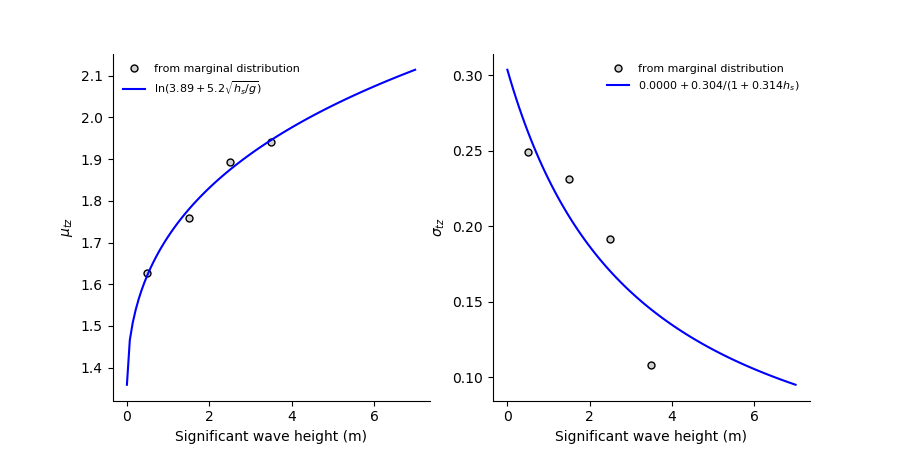

**************************************
Fit a model structure to measured data
**************************************

The module fitting_ implements functionality to fit a model structure to
measured environmental data. In other words, it can be used to estimate the
parameter values of a joint distribution.

.. _fitting: https://github.com/virocon-organization/viroconcom/blob/master/viroconcom/fitting.py

To fit a model structure to a dataset, we need to build an object of the
class ``Fit`` in this module.

Exemplary call::

    example_fit = Fit((sample_0, sample_1), (dist_description_0, dist_description_1))

It is important that the parameter ``samples`` is in the form (sample_0, sample_1, ...).
Each sample is a collection of data from type *list* and also all samples
have the same length. The parameter ``dist_descriptions`` describes the
structure of the probabilistic model that should be fitted to the sample. It
should be from type *list* and should contain a dictionary for each dimension
in the same sequence of the samples. It should accordingly have the same
length as ``samples``.

Each ``dist_description`` dictionary describes one dimension of the
probabilistic model structure.
It must contain the name of the current distribution under the key *name*, which
could be, for example, ``"Lognormal"``. If the distribution is conditional, it
also must contain the keys ``dependency`` and ``functions``. The ``dependency`` value
must be of type *list*. In the sequence of ``shape, loc, scale``, it contains
integers for the dependency of the current parameter or *None* if it has no
dependency. An entry of 0 means that the parameter depends upon the variable with
index 0, for example :math:`X_2|X_0`). The ``functions`` value is of type *list*
too, and is interpreted in the sequence ``shape, loc, scale``. Its entries define,
which dependence functions are fitted. Additional keys such as
``width_of_intervals`` or ``min_datapoints_for_fit`` are optional and can be used
to control the fitting procedure.

The following distributions are available under the given key values:

- **Weibull_2p** :  2-parameter Weibull distribution
- **Weibull_3p** :  translated Weibull distribution (sometimes simply called 3-parameter Weibull distribution)
- **Weibull_Exp** : exponentiated Weibull distribution
- **Lognormal** :  lognormal distribution parametrized with exp(mu) and sigma
- **Lognormal_SigmaMu** :  lognormal distribution parametrized with mu and sigma
- **Normal** :  normal distribution

The following dependence functions are available under the given key values:

- **power3** :  :math:`a + b * x^c`
- **exp3** : :math:`a + b * e^{x * c}`
- **lnsquare2** : :math:`\ln[a + b * \sqrt(x / 9.81)]`
- **powerdecrease3** : :math:`a + 1 / (x + b)^c`
- **asymdecrease3** : :math:`a + b / (1 + c * x)`
- **logistics4** : :math:`a + b / [1 + e^{-1 * |c| * (x - d)}]`
- **alpha3** : :math:`(a + b * x^c) / 2.0445^{1 / logistics4(x, c_1, c_2, c_3, c_4)}`
- **None** : no dependency

The following optional keys and values are available:

- **number_of_intervals** : int. The sample of this variable will be divided into the given number of intervals. Intervals will be equally spaced.
- **width_of_intervals** : float. The sample of htis variable will be divided into intervals with the given width.
- **min_datapoints_for_fit** : int. A marginal distribution will only be fitted to an interval if the interval contains at least the given number of observations.
- **do_use_weights_for_dependence_function** : boolean. If true the dependence function is fitted used weights that normalize each parameter value.
- **fixed_parameters** : list with one entry for each parameter. *None* is interpreted as the parameter is free. If a number is given, the parameter is fixed to that number and not estimated.

Example for a ``dist_description`` that could represent the marginal
distribution of significant wave height::

    dist_description_0 = {'name': 'Weibull_Exp',
                          'width_of_intervals': 1}

Example for a ``dist_description`` that could represent the conditonal
distribution of zero-up-crossiong period::

    dist_description_1 = {'name': 'Lognormal_SigmaMu',
                          'dependency': (0,  None, 0),
                          'functions': ('asymdecrease3', None, 'lnsquare2'),
                          'min_datapoints_for_fit': 50
                          }

If Fit() is finished, example_fit, will have the attribute ``mul_var_dist``
that is an object of ``MultivariateDistribution``, holding the fitted joint
distribution. Additionally, example_fit will have the attribute
``multiple_fit_inspection_data``, which can be used to analyze the goodness of fit.

Comprehensive example
---------------------

The following example is based on the file fit_distribution_similar_to_docs_ .

.. _fit_distribution_similar_to_docs: https://github.com/virocon-organization/viroconcom/blob/master/examples/fit_distribution_similar_to_docs.py

First, let us create a data set, which represents sea states. The first variable
is significant wave height, Hs, and the second variable spectral peak period,
Tp ::

    import matplotlib.pyplot as plt
    import numpy as np

    from viroconcom.read_write import read_ecbenchmark_dataset
    from viroconcom.fitting import Fit
    from viroconcom.contours import IFormContour
    from viroconcom.plot import SamplePlotData, plot_sample, plot_marginal_fit, \
        plot_dependence_functions, plot_contour

    sample_0, sample_1, label_hs, label_tz = \
        read_ecbenchmark_dataset('datasets/1year_dataset_A.txt')

    fig, ax = plt.subplots(1, 1, figsize=(5, 4.5))
    sample_plot_data = SamplePlotData(sample_1, sample_0)
    plot_sample(sample_plot_data, ax)
    plt.xlabel('Zero-up-crossing period (s)')
    plt.ylabel('Significant wave height (m)')
    plt.show()

The code snipped will create this plot:

.. figure:: fitting_fig1.png
    :scale: 100 %
    :alt: example contours plot

    1 year of measurements from NDBC's buoy 44007.

Now we describe the type of multivariate distribution that we want to fit to this data ::

    dist_description_0 = {'name': 'Weibull_Exp',
                          'width_of_intervals': 1}
    dist_description_1 = {'name': 'Lognormal_SigmaMu',
                          'dependency': (0,  None, 0),
                          'functions': ('asymdecrease3', None, 'lnsquare2'),
                          'min_datapoints_for_fit': 50
                          }

Based on this description, we can compute the fit and save the two fitted
distributions in dedicated variables ::

    my_fit = Fit((sample_0, sample_1), (dist_description_0, dist_description_1))

    fitted_hs_dist = my_fit.mul_var_dist.distributions[0]
    fitted_tz_dist = my_fit.mul_var_dist.distributions[1]

Now, let us plot the fit for the first variable using a QQ-plot ::

    fig, ax = plt.subplots(1, 1, figsize=(5, 4.5))
    plot_marginal_fit(sample_0, fitted_hs_dist, fig, ax, label='$h_s$ (m)', dataset_char='A')
    plt.show()

.. figure:: fitting_fig2.png
    :scale: 100 %
    :alt: fit of first variable

    QQ-plot showing the fitted exponentiated Weibull distribution and the empirical wave height data..

For our second variable, we need some more plots to inspect it properly.
Let us start with the marginal distributions that were fitted to Hs-intervals ::

    n_fits = len(my_fit.multiple_fit_inspection_data[1].scale_at)
    fig, axs = plt.subplots(1, n_fits, figsize=(14, 4))
    for i in range(n_fits):
            axs[i].set_title('Tz distribution for ' + str(i) + '≤Hs<' + str(i + 1))
            axs[i].hist(my_fit.multiple_fit_inspection_data[1].scale_samples[i], density=1)
            x = np.linspace(0, 12, 200)
            interval_center = my_fit.multiple_fit_inspection_data[1].scale_at[i]
            f = fitted_tz_dist.pdf(x, np.zeros(x.shape) + interval_center, (0, None, 0))
            axs[i].plot(x, f)
    plt.show()

.. figure:: fitting_fig3.png
    :scale: 60 %
    :alt: individual fits of second variable

    Fitted marginal distributions at different Hs intervals.

Now, let us analyze how well our dependence functions fit to the marginal
distributions' four scale and shape values ::

    fig = plt.figure()
    x_1 = np.linspace(0, 12, 100)
    plt.plot(param_grid, my_fit.multiple_fit_inspection_data[1].scale_value, 'x',
             label='discrete scale values')
    plt.plot(x_1, my_fit.mul_var_dist.distributions[1].scale(x_1),
             label='fitted dependence function')
    plt.xlabel('significant wave height [m]')
    plt.ylabel('scale parameter (Tp-distribution) [-]')
    plt.legend()
    plt.show()

    Fitted dependence function.

Finally, let us use the fitted joint distribution to compute an environmental
contour ::

    iform_contour = IFormContour(my_fit.mul_var_dist, 50, 1)
    fig, ax = plt.subplots(1, 1, figsize=(5, 4.5))
    plot_contour(iform_contour.coordinates[1], iform_contour.coordinates[0],
                 ax=ax, x_label=label_tz, y_label=label_hs,
                 sample_plot_data=sample_plot_data, upper_ylim=13)
    plt.show()

.. figure:: fitting_fig5.png
    :scale: 100 %
    :alt: environmental contour based on the fitted distribution

    50-year environmental contour based on the fitted distribution.