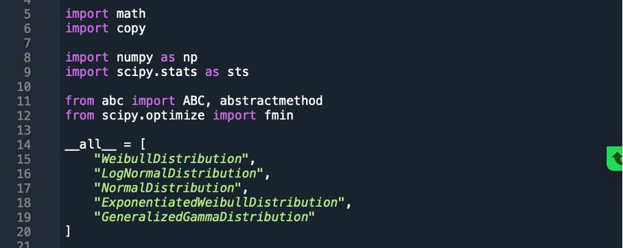
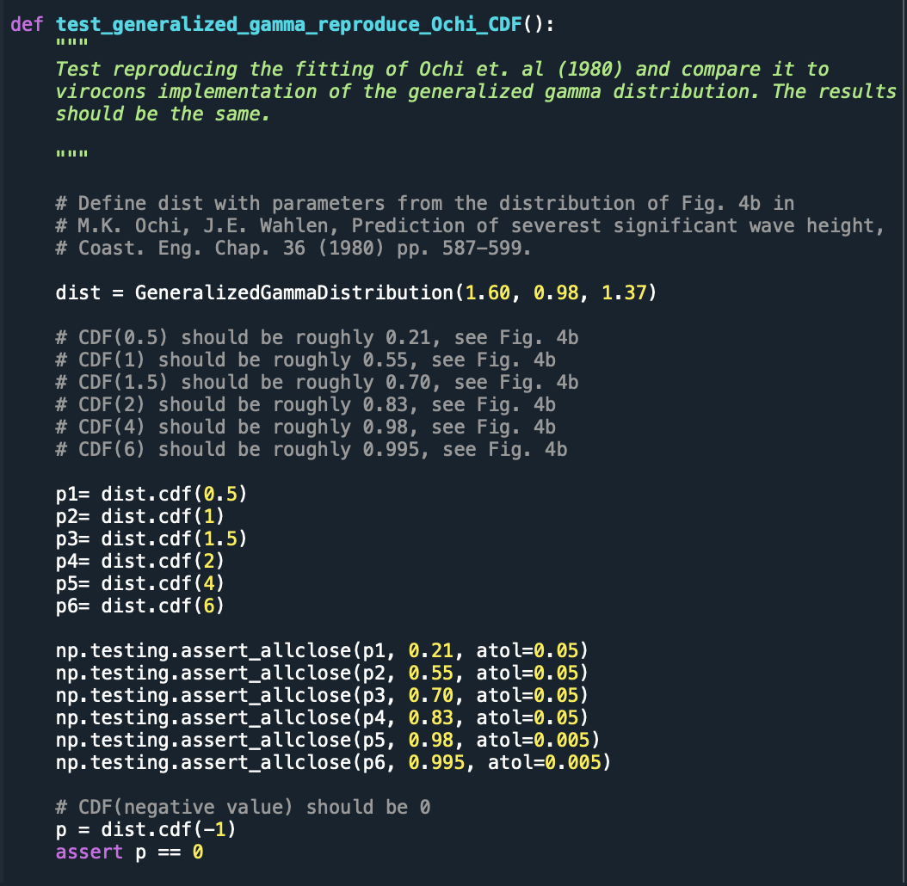

************************************************************
Defining custom joint models and estimating their parameters
************************************************************

.. warning::
    Stay tuned! We are currently working on this chapter.
    In the meantime if you have any questions feel free to open an issue.

Creating a global hierarchical model
~~~~~~~~~~~~~~~~~~~~~~~~~~~~~~~~~~~~

Implementing new statistical distributions in virocon: Example of the generalized gamma distribution
~~~~~~~~~~~~~~~~~~~~~~~~~~~~~~~~~~~~~~~~~~~~~~~~~~~~~~~~~~~~~~~~~~~~~~~~~~~~~~~~~~~~~~~~~~~~~~~~~~~~

When implementing a new distribution, we recommend orientating oneself on an already existing distribution in virocon.
You can use a virocon distribution as a template to implement a new distribution. The following sections describe how
the generalized gamma distribution was implemented.

**1. Clarify the mathematics of the distribution**:

In the following, we implement the 3-parameter generalized gamma distribution as recommended by Ochi (1992) [1]_.

:math:`f(x)= \frac{c}{\Gamma(m)}\lambda^{cm}x^{cm-1} \exp\Big[- (\lambda x)^{c}\Big]`

To implement the generalized gamma distribution, we make use of the functionality of scipy’s implementation of the
distribution. Scipy’s implementation is based on the scientific paper of Stacy (1962) [2]_. An overview of the
generalized gamma distribution is given in [3]_.

:math:`f(x)=  \frac{k(x-a)^{kc-1}}{b^{kc}\Gamma(c)} \exp \bigg[- \bigg(\frac{x-a}{b}\bigg)^{k}\bigg]`

The Stacy’s generalized gamma distribution involves 4 parameters. Two shape parameters (c, m) , one scale (a) and one
location parameter (λ). Note, that the above presentedOchi and Stacy’s formulas for the generalized gamma distribution
differ. Hence, to use scipy’s functionality, we must convert the individual parameters. Comparing the parameters,
it is seen, that:

1. c=k ,
2. m=c ,
3. a=0 , and
4. λ=1/b

Here, the two shape parameters can be implemented using scipy’s shape parameters. The location parameter will be set to
the fixed value zero and the scale parameter needs to be converted.

**2. Define the characteristics of the distribution and implement it step by step:**

This init method is called when an object of the class GammaDistribution is created. When a new gamma distribution
object is created, we want to make sure that the attributes of the distribution are passed. Therefore, we build a custom
initial state, where all parameters of the distribution are initialized with a default value.

.. code-block:: python

       def __init__(self, m=1, c=1, lambda_=1, f_m=None, f_c=None, f_lambda_=None):
        self.m = m  # shape
        self.c = c  # shape
        self.lambda_ = lambda_  # reciprocal scale
        self.f_m = f_m
        self.f_c = f_c
        self.f_lambda_ = f_lambda_

When fitting a distribution function, we want to be able to call the parameters. In virocon, this is ensured by
“property objects”. A property of an object in Python is a method that seems like a regular attribute to the user
(i.e. we can use obj.property instead of obj.property() ).

Since scipy uses a slightly different parametrization, than we do here, we need to convert the scale parameter between
these two parametrizations. For this purpose, we define scale as a property. This allows to calculate the scipy _scale
on the fly, using our value of _lambda. With the first method we define scale as a property, that we can call as
x = obj.scale . With the second method, we allow to set the "value" of _scale. (obj._scale = x ) , though again we do
not store the value directly but instead modify "lambda _" accordingly.

.. code-block:: python

    @property
    def parameters(self):
        return {"m": self.m, "c": self.c, "lambda_": self.lambda_}

    @property
    def _scale(self):
        return 1 / (self.lambda_)

    @_scale.setter
    def _scale(self, val):
        self.lambda_ = 1 / val

Given the case, that we do not know the values of the distribution's parameters, we want to initialize the parameters
with default values. In this function, when no value is indicated, we set the parameter to the value defined in the
_init. Again, we need to take care of the divergent scale parameter.

.. code-block:: python

    def _get_scipy_parameters(self, m, c, lambda_):
        if m is None:
            m = self.m
        if c is None:
            c = self.c
        if lambda_ is None:
            scipy_scale = self._scale
        else:
            scipy_scale = 1 / lambda_
        return m, c, 0, scipy_scale  # shape1, shape2, location=0, reciprocal scale

The key functions used to describe statistical distributions are the CDF, ICDF and PDF. Therefore, these functions are
implemented using scipy’s functions.

.. code-block:: python

    def cdf(self, x, m=None, c=None, lambda_=None):
        """
        Cumulative distribution function.

        Parameters
        ----------
        x : array_like,
            Points at which the cdf is evaluated.
            Shape: 1-dimensional.
        m : float, optional
            First shape parameter. Defaults to self.m.
        c : float, optional
            The second shape parameter. Defaults to self.c.
        lambda_: float, optional
            The reciprocal scale parameter . Defaults to self.lambda_.

        """

        scipy_par = self._get_scipy_parameters(m, c, lambda_)
        return sts.gengamma.cdf(x, *scipy_par)

    def icdf(self, prob, m=None, c=None, lambda_=None):
        """
        Inverse cumulative distribution function.

        Parameters
        ----------
        prob : array_like
            Probabilities for which the i_cdf is evaluated.
            Shape: 1-dimensional
        m : float, optional
            First shape parameter. Defaults to self.m.
        c : float, optional
            The second shape parameter. Defaults to self.c.
        lambda_: float, optional
            The reciprocal scale parameter . Defaults to self.lambda_.

        """

        scipy_par = self._get_scipy_parameters(m, c, lambda_)
        return sts.gengamma.ppf(prob, *scipy_par)

    def pdf(self, x, m=None, c=None, lambda_=None):
        """
        Probability density function.

        Parameters
        ----------
        x : array_like,
            Points at which the pdf is evaluated.
            Shape: 1-dimensional.
        m : float, optional
            First shape parameter. Defaults to self.m.
        c : float, optional
            The second shape parameter. Defaults to self.k.
        lambda_: float, optional
            The reciprocal scale parameter . Defaults to self.lambda_.

        """

        scipy_par = self._get_scipy_parameters(m, c, lambda_)
        return sts.gengamma.pdf(x, *scipy_par)

Another important function is to draw random samples from the distribution. Hence, every statistical function in
virocon must provide a draw_sample function:

.. code-block:: python

    def draw_sample(self, n, m=None, c=None, lambda_=None):
        scipy_par = self._get_scipy_parameters(m, c, lambda_)
        rvs_size = self._get_rvs_size(n, scipy_par)
        return sts.gengamma.rvs(*scipy_par, size=rvs_size)

Given a data set is available, a user might want to fit a generalized gamma distribution to these data. The fit method
returns estimates of the shape and scale parameters from data. The default estimation method is maximum likelihood
estimation (MLE), which is why in virocon all statistical distributions are equipped with a function to fit a
distribution to a data set by means of the MLE. Here, the user should be able to hold some parameters fixed to certain
values by passing in keyword arguments.

.. code-block:: python

    def _fit_mle(self, sample):
        p0 = {"m": self.m, "c": self.c, "scale": self._scale}

        fparams = {"floc": 0}

        if self.f_m is not None:
            fparams["fshape1"] = self.f_m
        if self.f_c is not None:
            fparams["fshape2"] = self.f_c
        if self.f_lambda_ is not None:
            fparams["fscale"] = 1 / (self.f_lambda_)

        self.m, self.c, _, self._scale = sts.gengamma.fit(
            sample, p0["m"], p0["c"], scale=p0["scale"], **fparams
        )

    def _fit_lsq(self, data, weights):
        raise NotImplementedError()

**3. Use new distribution**:

The above-described steps all must be implemented in the distributions.py file of virocon.
In order to use the new implemented distribution, add the name of the new distribution into the variable _all_=[] below
the imports.

**4. Write automatic tests**:

Before implementing the new distributions in virocon, we want to know, if the above-described steps and functions really
perform as expected. Therefore, the most accurate test is to reconstruct a distribution from literature and compare the
results. If the results match, we can have high certainty that we implemented the new distribution correctly. In
general, every function of a class must be tested. To conduct automatic tests, virocon uses pytest. To be able to
execute these tests automatically, the added test files for a new distribution must be attached to the file
test_distributions.py.

.. [1] Ochi, M. K. (1992). New approach for estimating the severest sea state. 23rd International Conference on Coastal Engineering, 512–525. https://doi.org/10.1061/9780872629332.038
.. [2] E.W. Stacy, “A Generalization of the Gamma Distribution”, Annals of Mathematical Statistics, Vol 33(3), pp. 1187–1192.
.. [3] Forbes, C.; Evans, M.; Hastings, N; Peacock, B. (2011), Statistical Distributions, 4th Edition, Published by John Wiley & Sons, Inc., Hoboken, New Jersey., Page 113