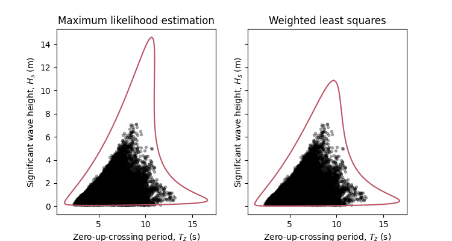

**************************************************
Statistical distributions and parameter estimation
**************************************************

Predefined joint models
~~~~~~~~~~~~~~~~~~~~~~~

Predefined joint model structures are available in the file `predefined.py`_.

Currently, four predefined models are available:
 * Wind speed – wave height model recommended in DNV’s guideline on environmental conditions [1]_
 * Wind speed – wave height model proposed by Haselsteiner et al. (2020) [2]_
 * Wave height - wave period model recommended in DNV’s guideline on environmental conditions [1]_
 * Wave height - wave period model proposed by Haselsteiner et al. (2020) [2]_

In the documentation's `quick start example`_ section a predefiend wave height - wave period model structure is used.

Custom joint models
~~~~~~~~~~~~~~~~~~~

In the documentation's `detailed examples`_ section custom joint models are defined and used (instead of predefined models).

Parameter estimation
~~~~~~~~~~~~~~~~~~~~

By default, marginal distribution parameters are estimated using maximum likelihood estimation and dependence function parameters 
are estimated using least squares, however, other fitting methods can be selected by specifying the ``fit_description'' dictionary.

The following example shows how first, default parameter estimation used and then weighted least squares is used to estimate the 
parameter values of the wave height's distribution.

.. code block:: python
        """
        Brief example that computes a sea state contour and compares MLE vs WLSQ fitting.
        """
        import matplotlib.pyplot as plt
        from virocon import (read_ec_benchmark_dataset, get_OMAE2020_Hs_Tz, 
            GlobalHierarchicalModel, IFORMContour, plot_2D_contour)

        # Load sea state measurements.
        data = read_ec_benchmark_dataset("datasets/ec-benchmark_dataset_A.txt")

        # Define the structure of the joint distribution model.
        dist_descriptions, fit_descriptions, semantics = get_OMAE2020_Hs_Tz()
        model = GlobalHierarchicalModel(dist_descriptions)

        # Estimate the model's parameter values with the default method (MLE).
        model.fit(data)

        # Compute an IFORM contour with a return period of 50 years.
        tr = 50 # Return period in years.
        ts = 1 # Sea state duration in hours.
        alpha = 1 / (tr * 365.25 * 24 / ts)
        contour1 = IFORMContour(model, alpha)

        # Estimate the model's parameter values using weighted lesat squares.
        fit_description_hs = {"method": "wlsq", "weights": "quadratic"}
        my_fit_descriptions = [fit_description_hs, None]
        model2 = GlobalHierarchicalModel(dist_descriptions)
        model2.fit(data, fit_descriptions=my_fit_descriptions)

        # Compute an IFORM contour with a return period of 50 years.
        tr = 50 # Return period in years.
        ts = 1 # Sea state duration in hours.
        alpha = 1 / (tr * 365.25 * 24 / ts)
        contour2 = IFORMContour(model2, alpha)

        # Plot the contours.
        fig, axs = plt.subplots(1, 2, figsize=[7.5, 4], sharex=True, sharey=True)
        plot_2D_contour(contour1, data, semantics=semantics, swap_axis=True, ax=axs[0])
        plot_2D_contour(contour2, data, semantics=semantics, swap_axis=True, ax=axs[1])
        titles = ["Maximum likelihood estimation", "Weighted least squares"]
        for i, (ax, title) in enumerate(zip(axs, titles)):
            ax.set_title(title)
        plt.show()

The code, which is available as a Python file here_, will create this plot:

Implementing new statistical distributions: Example of the generalized gamma distribution
~~~~~~~~~~~~~~~~~~~~~~~~~~~~~~~~~~~~~~~~~~~~~~~~~~~~~~~~~~~~~~~~~~~~~~~~~~~~~~~~~~~~~~~~~

When implementing a new distribution in virocon, we recommend orientating oneself on an already existing distribution in virocon.
You can use a virocon distribution as a template to implement a new distribution. The following sections describe how
the generalized gamma distribution was implemented.

**1. Clarify the mathematics of the distribution**:

In the following, we implement the 3-parameter generalized gamma distribution as recommended by Ochi (1992) [3]_.
Its probability density function (PDF) is defined as:

:math:`f(x)= \frac{c}{\Gamma(m)}\lambda^{cm}x^{cm-1} \exp\left[- (\lambda x)^{c} \right]`

To implement the generalized gamma distribution, we make use of the functionality of scipy’s implementation of the
distribution. Scipy’s implementation is based on the scientific paper of Stacy (1962) [4]_. An overview of the
generalized gamma distribution is given in [5]_.
Scipy uses the following PDF:

:math:`f(x)=  \frac{k(x-a)^{kc-1}}{b^{kc}\Gamma(c)} \exp \bigg[- \bigg(\frac{x-a}{b}\bigg)^{k}\bigg]`

Stacy’s generalized gamma distribution involves 4 parameters. Two shape parameters (k, c), one scale (b) and one
location parameter (a). Note that Ochi's and Stacy's formulas for the generalized gamma distribution
differ. Hence, to use scipy’s functionality, we must convert the individual parameters. Comparing the parameters,
it is seen, that:

1. c=k ,
2. m=c ,
3. a=0 , and
4. λ=1/b

Here, the two shape parameters can be implemented using scipy’s shape parameters. The location parameter will be set to
the fixed value zero and the scale parameter needs to be converted and inverted.

**2. Define the characteristics of the distribution and implement it step by step:**

To implement a new distribution, the new distribution class - in our case the GammaDistribution class - should inherit
from the Distribution class in distributions.py.

This init method is called when an object of the class GammaDistribution is created. When a new gamma distribution
object is created, we want to make sure that the attributes of the distribution are passed. Therefore, we build a custom
constructor, where all parameters of the distribution are initialized with a default value.

.. code-block:: python

       def __init__(self, m=1, c=1, lambda_=1, f_m=None, f_c=None, f_lambda_=None):
        self.m = m  # shape
        self.c = c  # shape
        self.lambda_ = lambda_  # reciprocal scale
        self.f_m = f_m
        self.f_c = f_c
        self.f_lambda_ = f_lambda_

When fitting a distribution function, we want to be able to call the parameters. In virocon, this is ensured by
"property functions". A property of an object in Python is a method that seems like a regular attribute to the user
(i.e. we can use obj.property instead of obj.property() ).

Since scipy uses a slightly different parametrization, than we do here, we need to convert the scale parameter between
these two parametrizations. For this purpose, we define the scipy scale as a property. This allows to calculate the
scipy _scale on the fly, using our value of `lambda_`. With the first method we define scale as a property, that we can
call as x=obj._scale . With the second method, we allow to set the "value" of _scale. (obj._scale = x ) , though again
we do not store the value directly but instead modify `lambda_` accordingly.

.. code-block:: python

    @property
    def parameters(self):
        return {"m": self.m, "c": self.c, "lambda_": self.lambda_}

    @property
    def _scale(self):
        return 1 / (self.lambda_)

    @_scale.setter
    def _scale(self, val):
        self.lambda_ = 1 / val

Here, we convert our parameters to the format scipy understands. It allows to pass values to convert, but if they are
None, it uses the distribution instance's current values instead.

.. code-block:: python

    def _get_scipy_parameters(self, m, c, lambda_):
        if m is None:
            m = self.m
        if c is None:
            c = self.c
        if lambda_ is None:
            scipy_scale = self._scale
        else:
            scipy_scale = 1 / lambda_
        return m, c, 0, scipy_scale  # shape1, shape2, location=0, reciprocal scale

The key functions used to describe statistical distributions are the CDF, ICDF and PDF. Therefore, these functions are
implemented using scipy’s functions.

.. code-block:: python

    def cdf(self, x, m=None, c=None, lambda_=None):
        """
        Cumulative distribution function.

        Parameters
        ----------
        x : array_like,
            Points at which the cdf is evaluated.
            Shape: 1-dimensional.
        m : float, optional
            First shape parameter. Defaults to self.m.
        c : float, optional
            The second shape parameter. Defaults to self.c.
        lambda_: float, optional
            The reciprocal scale parameter . Defaults to self.lambda_.

        """

        scipy_par = self._get_scipy_parameters(m, c, lambda_)
        return sts.gengamma.cdf(x, *scipy_par)

    def icdf(self, prob, m=None, c=None, lambda_=None):
        """
        Inverse cumulative distribution function.

        Parameters
        ----------
        prob : array_like
            Probabilities for which the i_cdf is evaluated.
            Shape: 1-dimensional
        m : float, optional
            First shape parameter. Defaults to self.m.
        c : float, optional
            The second shape parameter. Defaults to self.c.
        lambda_: float, optional
            The reciprocal scale parameter . Defaults to self.lambda_.

        """

        scipy_par = self._get_scipy_parameters(m, c, lambda_)
        return sts.gengamma.ppf(prob, *scipy_par)

    def pdf(self, x, m=None, c=None, lambda_=None):
        """
        Probability density function.

        Parameters
        ----------
        x : array_like,
            Points at which the pdf is evaluated.
            Shape: 1-dimensional.
        m : float, optional
            First shape parameter. Defaults to self.m.
        c : float, optional
            The second shape parameter. Defaults to self.k.
        lambda_: float, optional
            The reciprocal scale parameter . Defaults to self.lambda_.

        """

        scipy_par = self._get_scipy_parameters(m, c, lambda_)
        return sts.gengamma.pdf(x, *scipy_par)

Another important function is to draw random samples from the distribution. Hence, every statistical function in
virocon must provide a draw_sample function:

.. code-block:: python

    def draw_sample(self, n, m=None, c=None, lambda_=None):
        scipy_par = self._get_scipy_parameters(m, c, lambda_)
        rvs_size = self._get_rvs_size(n, scipy_par)
        return sts.gengamma.rvs(*scipy_par, size=rvs_size)

Given a data set is available, a user might want to fit a generalized gamma distribution to these data. The fit() method
does not provide a return value, instead it sets the instance's values. The default estimation method is maximum
likelihood estimation (MLE), which is why in virocon all statistical distributions are equipped with a function to fit a
distribution to a data set by means of the MLE. The user does not pass in keywords arguments here. If a user wants to
fix values, they need to pass them to the constructor (__init__).

.. code-block:: python

    def _fit_mle(self, sample):
        p0 = {"m": self.m, "c": self.c, "scale": self._scale}

        fparams = {"floc": 0}

        if self.f_m is not None:
            fparams["fshape1"] = self.f_m
        if self.f_c is not None:
            fparams["fshape2"] = self.f_c
        if self.f_lambda_ is not None:
            fparams["fscale"] = 1 / (self.f_lambda_)

        self.m, self.c, _, self._scale = sts.gengamma.fit(
            sample, p0["m"], p0["c"], scale=p0["scale"], **fparams
        )

    def _fit_lsq(self, data, weights):
        raise NotImplementedError()

**3. Use new distribution**:

The above-described steps can be implemented in the distributions.py file of virocon. However, any other file is valid
as well. It's just that the base class Distribution is defined in distributions.py. (If one uses another file it is
necessary to import it). The following describes how to add the distribution to virocon, which is entirely optional.
In order to use the new implemented distribution, add the name of the new distribution into the variable _all_=[] below
the imports.

.. code-block:: python

    import math
    import copy

    import numpy as np
    import scipy.stats as sts

    from abc import ABC, abstractmethod
    from scipy.optimize import fmin

    __all__ = [
        "WeibullDistribution",
        "LogNormalDistribution",
        "NormalDistribution",
        "ExponentiatedWeibullDistribution",
        "GeneralizedGammaDistribution",
    ]

**4. Write automatic tests**:

Before implementing the new distributions in virocon, we want to know, if the above-described steps and functions really
perform as expected. Therefore, the most accurate test is to reconstruct a distribution from literature and compare the
results. If the results match, we can have high certainty that we implemented the new distribution correctly. In
general, every function of a class should be tested. To conduct automatic tests, virocon uses pytest. To be able to
execute these tests automatically, the added test files for a new distribution must be attached to the file
test_distributions.py.

.. code-block:: python

    def test_generalized_gamma_reproduce_Ochi_CDF():
        """
        Test reproducing the fitting of Ochi (1992) and compare it to
        virocons implementation of the generalized gamma distribution. The results
        should be the same.

        """

        # Define dist with parameters from the distribution of Fig. 4b in
        # M.K. Ochi, New approach for estimating the severest sea state from
        # statistical data , Coast. Eng. Chapter 38 (1992)
        # pp. 512-525.

        dist = GeneralizedGammaDistribution(1.60, 0.98, 1.37)

        # CDF(0.5) should be roughly 0.21, see Fig. 4b
        # CDF(1) should be roughly 0.55, see Fig. 4b
        # CDF(1.5) should be roughly 0.70, see Fig. 4b
        # CDF(2) should be roughly 0.83, see Fig. 4b
        # CDF(4) should be roughly 0.98, see Fig. 4b
        # CDF(6) should be roughly 0.995, see Fig. 4b

        p1 = dist.cdf(0.5)
        p2 = dist.cdf(1)
        p3 = dist.cdf(1.5)
        p4 = dist.cdf(2)
        p5 = dist.cdf(4)
        p6 = dist.cdf(6)

        np.testing.assert_allclose(p1, 0.21, atol=0.05)
        np.testing.assert_allclose(p2, 0.55, atol=0.05)
        np.testing.assert_allclose(p3, 0.70, atol=0.05)
        np.testing.assert_allclose(p4, 0.83, atol=0.05)
        np.testing.assert_allclose(p5, 0.98, atol=0.005)
        np.testing.assert_allclose(p6, 0.995, atol=0.005)

        # CDF(negative value) should be 0
        p = dist.cdf(-1)
        assert p == 0

.. _[1] DNV GL (2017). Recommended practice DNVGL-RP-C205: Environmental conditions and environmental loads.
.. _[2] Haselsteiner, A. F., Sander, A., Ohlendorf, J.-H., & Thoben, K.-D. (2020). Global hierarchical models for wind and wave contours: Physical interpretations of the dependence functions. Proc. 39th International Conference on Ocean, Offshore and Arctic Engineering (OMAE 2020). https://doi.org/10.1115/OMAE2020-18668
.. _[3] Ochi, M. K. (1992). New approach for estimating the severest sea state. 23rd International Conference on Coastal Engineering, 512–525. https://doi.org/10.1061/9780872629332.038
.. _[4] E.W. Stacy, “A Generalization of the Gamma Distribution”, Annals of Mathematical Statistics, Vol 33(3), pp. 1187–1192.
.. _[5] Forbes, C.; Evans, M.; Hastings, N; Peacock, B. (2011), Statistical Distributions, 4th Edition, Published by John Wiley & Sons, Inc., Hoboken, New Jersey., Page 113
.. _predefined.py: https://github.com/virocon-organization/virocon/blob/master/virocon/predefined.py
.. _here: https://github.com/virocon-organization/virocon/blob/master/examples/hstz_contour_simple_wls_vs_mle.py
.. _quick start example: https://virocon.readthedocs.io/en/latest/example.html
.. _detailed examples: https://virocon.readthedocs.io/en/latest/detailed_examples.html