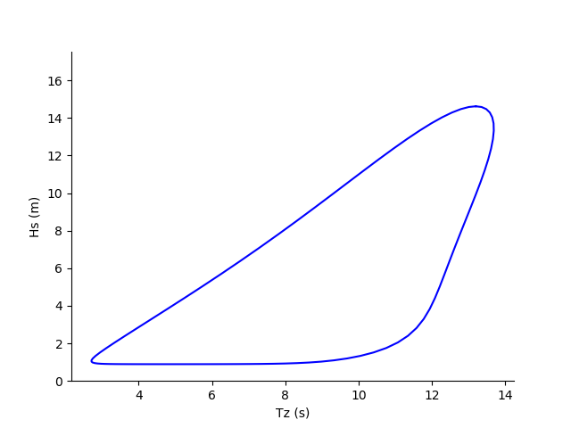

***************************************************
Define a joint distribution and calculate a contour
***************************************************
This chapter will explain how joint distributions and contours are handled in
viroconcom. The process of estimating the parameter values of a joint distribution,
the "fitting" is explained in the next chapter_.

.. _chapter: https://virocon-organization.github.io/viroconcom/fitting.html

To create an environmental contour, first, we need to define a joint distribution.
Then, we can choose a specific contour method and initiate the calculation.
viroconcom uses so-called global hierarchical models to define the joint
distribution and offers four common methods how an environmental
contour can be defined based on a given joint distribution.

If the joint distribution is known, the procedure of calculating an environmental
contour with viroconcom can be summarized as:

1. Create a first, independent univariate distribution.

2. Create another, usually dependent univariate distribution and define its dependency on the previous distributions.

3. Repeat step 2, until you have created a univariate distribution for each environmental variable.

4. Create a joint distribution by bundling the created univariate distributions.

5. Define the contour's return period and environmental state duration.

6. Choose a type of contour: :class:`~viroconcom.contours.IFormContour`, :class:`~viroconcom.contours.ISormContour`, :class:`~viroconcom.contours.DirectSamplingContour` or :class:`~viroconcom.contours.HighestDensityContour`.

7. Initiate the calculation.

These steps are explained in more detail in the following.

The file calculate_contours_similar_to_docs_ contains all the code that we will
show on this page. We will use the sea state model that was proposed by
Vanem and Bitner-Gregersen (2012; DOI: 10.1016/j.apor.2012.05.006) and compute
environmental contours with return periods of 25 years.

.. _calculate_contours_similar_to_docs: https://github.com/virocon-organization/viroconcom/blob/master/examples/calculate_contours_similar_to_docs.py

.. _create-independent-dist:

Create independent distribution
===============================

Distributions are represented by the abstract class
:class:`~viroconcom.distributions.Distribution`. This class is further
subclassed by the abstract class
:class:`~viroconcom.distributions.ParametricDistribution`. Distributions of
this kind are described by three or four parameters:
``shape``, ``loc``, ``scale`` and possibly ``shape2``.
Though not all distributions need to make use of all parameters.

Currently there are four parametric distribution subclasses one can use to
instantiate a distribution:

* :class:`~viroconcom.distributions.WeibullDistribution`
* :class:`~viroconcom.distributions.ExponentiatedWeibullDistribution`
* :class:`~viroconcom.distributions.LognormalDistribution`
* :class:`~viroconcom.distributions.NormalDistribution`

This table shows, which variables of the probability density function are are
defined by specifying the scale, shape and location parameters:

.. figure:: distributions_with_parameters.png
   :alt: Distributions implemented in viroconcom and their parameters.
   :align: center

   Distributions implemented in viroconcom and their parameters.


For the parameters there is the abstract class
:class:`~viroconcom.params.Param`. As we want to create an independet
distribution, we use the subclass :class:`~viroconcom.params.ConstantParam` to
define ``shape``, ``loc``, and ``scale``.

Say we want to create a Weibull distribution with ``shape=1.471``, ``loc=0.8888``,
and ``scale=2.776`` (as in the model proposed by Vanem and Bitner-Gregersen).

We first create the parameters::

    shape = ConstantParam(1.471)
    loc = ConstantParam(0.8888)
    scale = ConstantParam(2.776)


And then create our Weibull distribution::

    dist0 = WeibullDistribution(shape, loc, scale)

We also need to create a dependency tuple for creating a
:class:`~viroconcom.distribution.MultivariateDistribution` later on.
This is a 3-element tuple with either ``int`` or ``None`` as entries.
The first entry corresponds to ``shape``, the second to ``loc`` and the third
to ``scale``.
For an independent distribution all entries need to be set to ``None``. ::

    dep0 = (None, None, None)


.. _create-dependent-dist:

Create dependent distribution
=============================

In a global hierarchical model, the dependency of a parametric distribution is
described with dependence functions for the distribution's parameters.
In Chapter :ref:`create-independent-dist` we used
:class:`~viroconcom.params.ConstantParam` for the parameters. There is also
:class:`~viroconcom.params.FunctionParam`, which can represent different
dependence functions. It is callable and returns a parameter value depending
on the value called with.

The following dependence functions, :math:`f(x)`, are available under the given labels:

- **power3** :  :math:`f(x) = a + b * x^c`
- **exp3** : :math:`f(x) = a + b * e^{x * c}`
- **lnsquare2** : :math:`f(x) = \ln[a + b * \sqrt(x / 9.81)]`
- **powerdecrease3** : :math:`f(x) = a + 1 / (x + b)^c`
- **asymdecrease3** : :math:`f(x) = a + b / (1 + c * x)`
- **logistics4** : :math:`f(x) = a + b / [1 + e^{-1 * |c| * (x - d)}]`
- **alpha3** : :math:`f(x) = (a + b * x^c) / 2.0445^{1 / logistics4(x, c_1, c_2, c_3, c_4)}`

Say we have a random variable :math:`X` that is described by the distribution
created in :ref:`create-independent-dist`. Now we want to create a
distribution that describes the random variable :math:`Y`, which is dependent
on :math:`X` (in common notation :math:`Y|X`).

For this, we first need to define an order of the distributions, so that we
can determine on which distributions another may depend. We define this order,
as the order in which the univariate distribution are later on passed to
the :class:`~viroconcom.distributions.MultivariateDistribution` constructor.
For now we use the order of creation. The first distribution (that was described in
Chapter :ref:`create-independent-dist`) has the index ``0``.
We use this order in the dependency tuples.

As already described in Chapter :ref:`create-independent-dist` the 3 entries in the
tuple correspond to the ``shape``, ``loc``,  and ``scale`` parameters and the
entries are either ``int`` or ``None``. If an entry is ``None``, the
corresponding parameter is independent. If an entry is an ``int`` the parameter
depends on the distribution with that index, in the order defined above.

For example, a dependency tuple of :code:`(0, None, 1)` means, that ``shape``
depends on the first distribution, ``loc`` is independent and ``scale``
depends on the second distribution.

We now want to create a dependent lognormal distribution. Opposed to, for
example, a Weibull or normal distribution, a lognormal distribution is often
not described by ``shape``, ``loc``,  and ``scale``, but by the
mean ``mu`` and standard deviation ``sigma`` of the corresponding normal
distribution. In this example, we want ``mu`` and ``sigma`` to depend on the
prior created Weibull distribution. The ``loc`` parameter is ignored by
the :class:`~viroconcom.distribution.LognormalDistribution`.

The conversion between ``shape``, ``scale``, ``mu`` and ``sigma`` is:

.. math::
    shape = \sigma

.. math::
    scale = e^{\mu}

The class :class:`~viroconcom.distribution.LognormalDistribution` has a
constructor for ```shape`` and ``scale`` as well as for ``mu`` and ``sigma``.

Say we want to define the following dependence structure, where :math:`x` is a
realization of :math:`X`:

.. math::
    \sigma(x) = 0.04 + 0.1748 * e^{-0.2243}

.. math::
    \mu(x) = 0.1 + 1.489^{x * 0.1901}

In viroconcom, to define this dependence structure, first we create the
parameters as :class:`~viroconcom.params.FunctionParam` using the keywords
"exp3" and "power" to specify the wanted dependence functions ::

    my_sigma = FunctionParam('exp3', 0.04, 0.1748, -0.2243)
    my_mu = FunctionParam('power3', 0.1, 1.489, 0.1901)

Then we create the :class:`~viroconcom.distribution.LognormalDistribution`
using the ``mu`` ``sigma`` constructor::

    dist1 = LognormalDistribution(sigma=my_sigma, mu=my_mu)

And eventually define the dependency tuple::

    dep1 = (0, None, 0)

Alternativly we could have defined the distribution as follows,
using the wrapper argument of the :class:`~viroconcom.params.FunctionParam`::

    shape = FunctionParam(0.04, 0.1748, -0.2243, "exp3")
    scale = FunctionParam(0.1, 1.1489, 0.1901, "power3", wrapper=numpy.exp)
    dist1 = LognormalDistribution(shape, None, scale)
    dep1 = (0, None, 0)

.. _bundle-multvar-dist:

Bundle distributions and dependencies in a multivariate distribution
====================================================================

To create a contour, we need a joint distribution. In viroconcom joint
distributions can be represented by the
:class:`~viroconcom.distributions.MultivariateDistribution` class.

To create a :class:`~viroconcom.distributions.MultivariateDistribution` we
first have to bundle the distributions and dependencies in lists::

    distributions = [dist0, dist1]
    dependencies = [dep0, dep1]

The :class:`~viroconcom.distributions.MultivariateDistribution` can now
simply be created by passing these lists to the constructor::

    mul_dist = MultivariateDistribution(distributions, dependencies)


Constructing the contour
========================

Next, we need to define the contour's exceedance probability, :math:`\alpha`,
which is calculated using the return period, :math:`t_R`, and the model's state
duration, :math:`t_S`:

.. math::
    \alpha = t_S / t_R

In viroconcom the return period is assumed to be given in years and the state
duration is assumed to be given in hours.

Then we can select one of the four contour methods:

- :ref:`Inverse first-order reliabilty method (IFORM) <iform>`
- Inverse second-order reliablity method (ISORM)
- Direct sampling contour method
- :ref:`Highest density contour method <hdc>`


.. _iform:

Inverse first-order reliability method (IFORM)
----------------------------------------------

With all contours, we need to specify the return period and the state duration.
In addition, to create an IFORM contour we need to specify the number of points
along the contour that shall be calculated.

Let us calculate 90 points along the contour such that we have a resolution of 2
degrees. With the :ref:`previously created <bundle-multvar-dist>` ``mul_dist``,
we can compute a contour with a ``return_period`` of ``25`` years and a
``state_duration`` of ``6`` hours  like this::

    iform_contour = IFormContour(mul_dist, 25, 6, 90)


.. _hdc:

Highest density contour method
------------------------------

To create a highest density contour one has to specify a grid in variable
space in addition to return period and state duration. This is done by passing
the grid's ``limits`` and ``deltas`` to the constructor. ``limits`` has to be
a list of tuples containing the min and max limits for the variable space,
one tuple for each dimension. ``deltas`` specifies the grid cell size. It
is either a list of length equal to the number of dimension, containing
the step size per dimensions or a scalar. If it is a scalar it is used
for all dimensions.

The grid includes the min and max values: ``x = [min, min + delta, ..., max - delta, max]``

To create a highest density contour for the
:ref:`previously created <bundle-multvar-dist>` ``mul_dist`` with a
``return_period`` of ``25`` years and a ``state_duration`` of ``6``,  we first
define the variable space to be between 0 and 20 and set the step size to 0.5
in the first and 0.1 in the second dimension.::

    limits = [(0, 20), (0, 20)]
    deltas = [0.5, 0.1]

The contour can then be created as follows::

    hdens_contour = HighestDensityContour(mul_dist, 25, 6, limits, deltas)


Plotting the contour
--------------------

To plot the contour one has be access the ``coordinates`` attribute of the contour.

Using for example ``matplotlib`` the following code... ::

    import matplotlib.pyplot as plt

    plt.scatter(iform_contour.coordinates[1], iform_contour.coordinates[0],
                label='IFORM contour')
    plt.scatter(hdens_contour.coordinates[1], hdens_contour.coordinates[0],
                label='Highest density contour')
    plt.xlabel('Zero-up-crossing period, Tz (s)')
    plt.ylabel('Significant wave height, Hs (m)')
    plt.legend()
    plt.show()

creates this plot:

.. figure:: example_contours_iform_and_hdc.png
    :scale: 100 %
    :alt: example contours plot

    Plot of the calculated IFORM and highest density contours.

Alternatively, we could use viroconcom's standard plotting function... ::


    from viroconcom.plot import plot_contour

    plot_contour(iform_contour.coordinates[1], iform_contour.coordinates[0],
                 x_label='Tp (s)', y_label='Hs (m)')
    plt.show()


to create this plot:



    IFORM contour plotted with the function plot_contour().