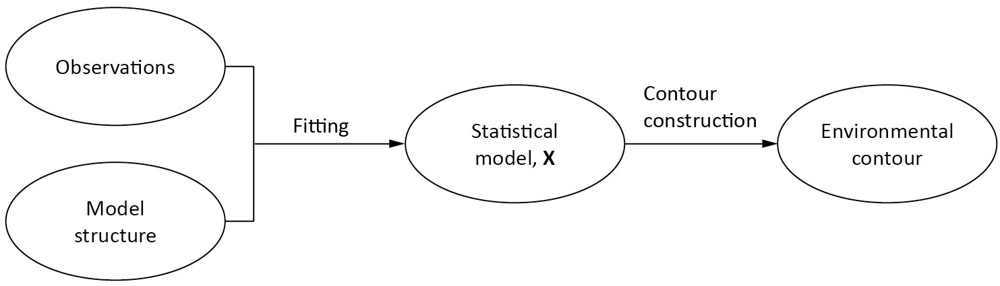
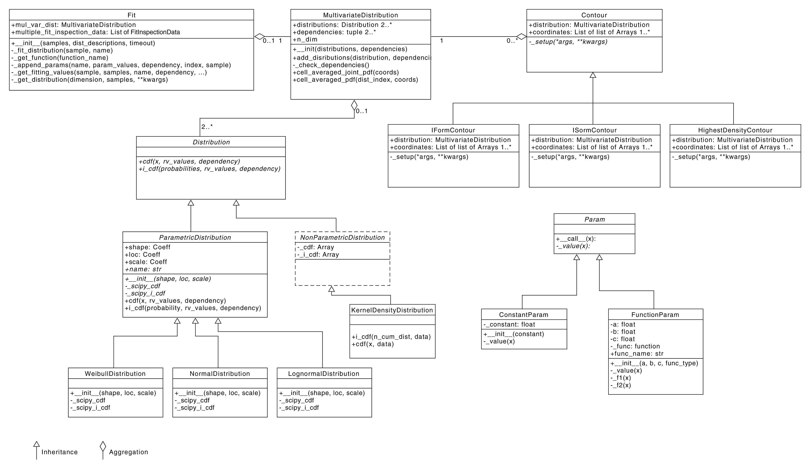

*******************************************
Overall work flow and software architecture
*******************************************

Figure 1 shows a flowchart that captures the overall functionality of
``viroconcom``. A statistical model can be defined by fitting a model structure to
measured data. Then, this statistical model can be used to construct an
environmental contour.

    Figure 1. Flowchart showing how the process of fitting a model structure to
    measured data and constructing an environmental contour.

In ``viroconcom`` the class ``Fit`` handles the fitting and the class
``Contour`` (and its child classes) handle the contour construction.

Figure 2 shows ``viroconcom``'s class diagram.

    Figure 2. Class diagram showing among others the class Fit, which handles
    fitting a model structure to a dataset, and the class Contour, which
    handles contour construction. This class diagram was created for viroconcom
    version 1.1.0.
